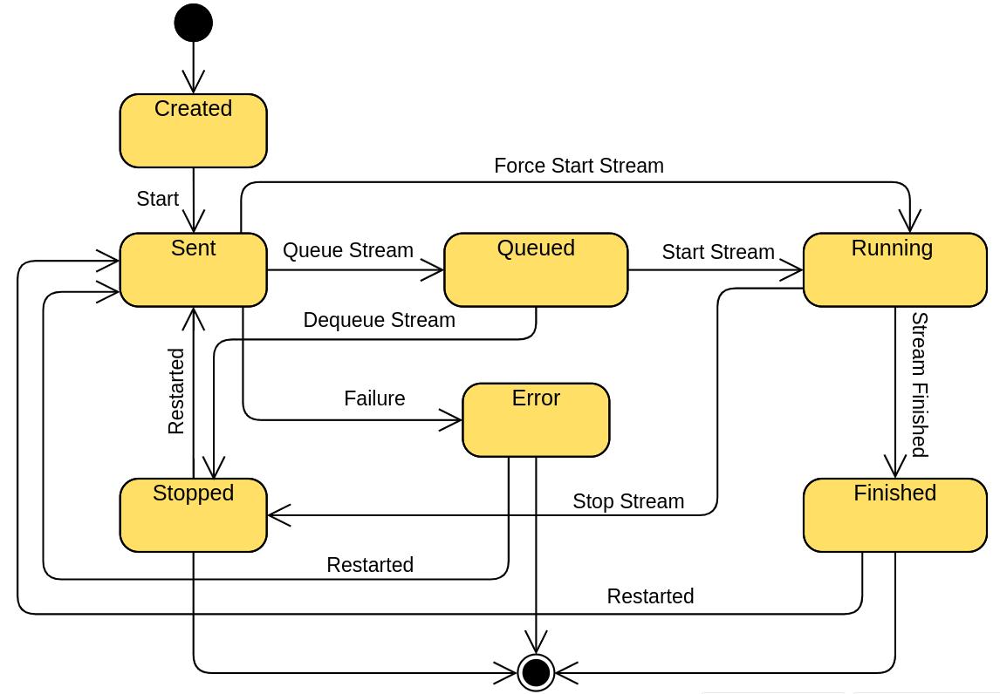
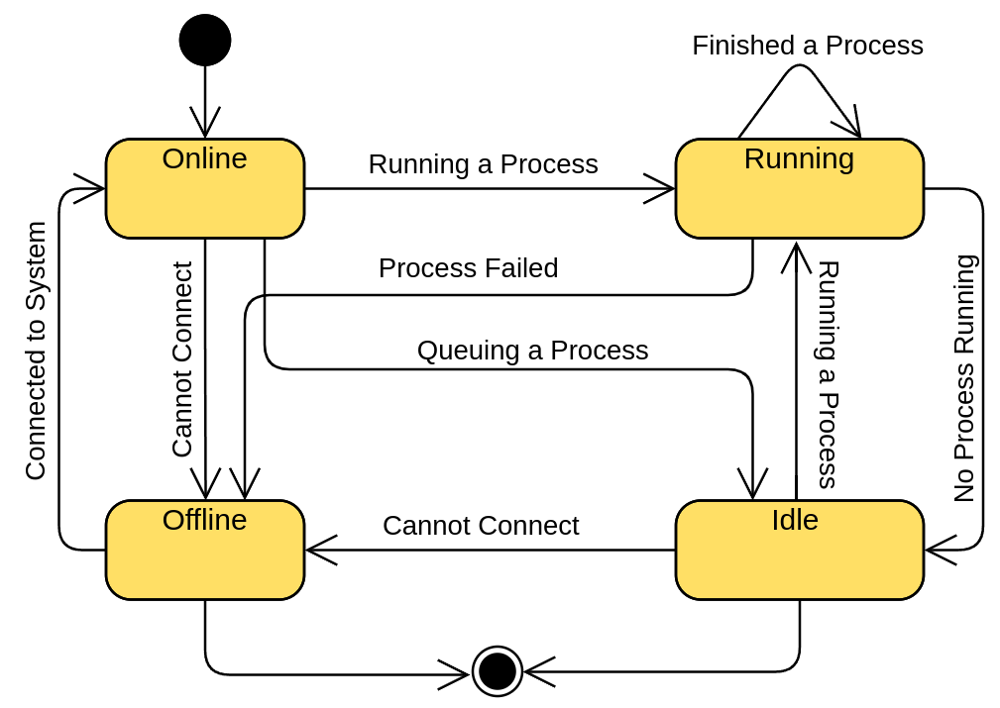
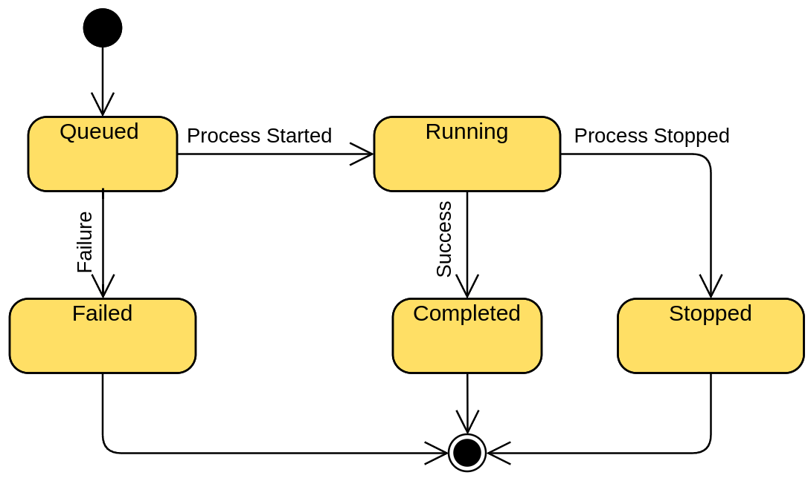

# E-Jam API

<p align="center" ></p>


## INTRODUCTION

This API is used to create and manage streams.
The E-Jam API is a REST API that allows you to manage the list of streams in the E-Jam application.
The API is implemented using the Actix Web framework and Rust.

The API is hosted on port 8084.

## The E-Jam API documentation

To view the E-Jam API documentation, run the following command:

```bash
cargo doc --open
```

## How to run the E-Jam API

Make sure you have Rust installed on your machine.

To run the E-Jam API, run the following command:

```bash
cargo run
```

## Running the E-Jam API in Docker container

To run the E-Jam API in a Docker container, run the following command:

```bash
docker pull aabdaa/center-point
sudo docker run --network=host aabdaa/center-point
```

Or you can build the Docker image yourself by running the following command:

```bash
sudo docker build -t center-point .
sudo docker run --network=host center-point
```

the API will be available on port 8084 on your machine.
Or you can run the following command to run the API in the background:

```bash
sudo docker run -d --network=host aabdaa/center-point
```

## How to test the E-Jam API

To test the E-Jam API, run the following command:

```bash
cargo run --features fake_data
```

This will run the E-Jam API with fake data and a random statics generator for both the generators and the verifiers of the system.
Keep in mind that the Kafka server must be running and the schemas should be registered in the schema registry for the producer to work. (which you can find in the [E-Jam Kafka Docker](../kafka_stack_docker_compose/README.md))

## Logging in the API

you can set the logger to your liking by setting the [logger.yml](logger.yml) file to your liking.
For more information about the logger, check the [env_logger](https://docs.rs/log/latest/log/) and [log4rs](https://docs.rs/log4rs/latest/log4rs/) documentation.

## The E-Jam System

The System has Three Components:

- **Streams** A stream is a collection of devices and processes that are used to generate and verify packets in the network.
- **Devices** A device is a device that is used to generate and verify packets in the network.
- **Processes** A process is a process that is used to generate and verify packets in the network.

## State Machines

### Stream State Machine

The stream state machine is as follows:



> NOTE: The stream state finished is only applied when all devices have finished sending and receiving packets.

### Device State Machine

The Device State Machine is as follows:



### Process State Machine

The Process State Machine is as follows:



## Endpoints

### GET /streams

Returns a list of all streams in the list of streams.

### GET /streams/{stream_id}

Returns the stream with the given stream_id.

### POST /streams

Adds a new stream to the list

### DELETE /streams/{stream_id}

Deletes the stream with the given stream_id.

### PUT /streams/{stream_id}

Updates the stream with the given stream_id.

### POST /streams/{stream_id}/start

Starts the stream with the given stream_id in body.

### POST /streams/{stream_id}/force_start

Forces the stream with the given stream_id to start.

### POST /streams/start_all

Starts all streams in the list of streams.

### POST /streams/{stream_id}/stop

Stops the stream with the given stream_id.

### POST /streams/{stream_id}/force_stop

Forces the stream with the given stream_id to stop.

### POST /streams/stop_all

Stops all streams in the list of streams.

### GET /streams/{stream_id}/status

Returns the status of the stream with the given stream_id.

### GET /streams/status_all

Returns the status of all streams in the list of streams.

### GET /devices

Returns a list of all devices in the list of devices.

### GET /devices/{device_mac}

Returns the device with the given device mac address.

### POST /devices

Adds a new device to the list

### DELETE /devices/{device_mac}

Deletes the device with the given device_mac.

### PUT /devices/{device_mac}

Updates the device with the given device_mac.

### /devices/{device_mac}/ping

Pings the device with the given device_mac.

### GET /devices/ping_all

Pings all devices in the list of devices.

### GET /devices/ping

Pings the device with the given device data.

### post /streams/{stream_id}/started

Notify the system that the stream is started by the device

### post /streams/{stream_id}/finished

Notify the system that the stream is finished by the device

## System API endpoints

The default port for the system API is 8000.
The following endpoints are available for the system API:

### Get / (index)

will be called to Ping the system API and check if it is Online. (will be used in the devices Radar)

### Post /connect

will be called to Connect to the system API and register the device in the system only if the mac address provided is accepted by the systemAPI.

### Post /start

Generate or verify the Provided Stream.

### Post /stop

Stop a currently running Stream.

All endPoint headers will have mac-address = the mac address of the device that started the stream for verification.

## Data Structures

### Stream Details object

The StreamDetails struct is used to store the information about the stream that is sent to the device to start or queue the stream

- `stream_id` - A String that represents the id of the stream that is used to identify the stream in the device, must be alphanumeric, max is 3 bytes (36^3 = 46656)
- `delay` - A u64 that represents the time in ms that the stream will wait before starting
- `time_to_live` - A u64 that represents the time to live that will be used for the stream
- `inter_frame_gap` - A u64 that represents the time in ms that will be waited between each frame
- `generators` - A Vec of String that has all the mac addresses of the devices that will generate the stream
- `verifiers` - A Vec of String that has all the mac addresses of the devices that will verify the stream
- `number_of_packets` - A u64 that represents the number of packets that will be sent in the stream
- `broadcast_frames` - A u64 that represents the number of broadcast frames that will be sent in the stream
- `payload_length` - A u16 that represents the length of the payload that will be used in the stream
- `payload_type` - A u8 that represents the type of the payload that will be used in the stream (0, 1, 2)
- `burst_length` - A u64 that represents the number of packets that will be sent in a burst
- `burst_delay` - A u64 that represents the time in ms that will be waited between each burst
- `seed` - A u64 that represents the seed that will be used to generate the payload
- `flow_type` - A u8 that represents the flow type that will be used for the stream (0 = BtB, 1 = Bursts)
- `transport_layer_protocol` - A u8 that represents the transport layer protocol that will be used for the stream (0 = TCP, 1 = UDP)
- `check_content` - A bool that represents if the content of the packets will be checked

## Stream Entry object

The StreamEntry struct is used to store the information about the stream with its status and the status of the devices that are running the stream
Notice: The stream Data is sent in camelCase naming style.

The Key of the Stream object is the stream_id.
The structure of the Stream object as a table is as follows:

- `stream_id` - A String that represents the id of the stream that is used to identify the stream in the device, must be alphanumeric, max is 3 bytes (36^3 = 46656)
- `name` - A String that represents the name of the stream (used for clarification)
- `description` - A String that represents the description of the stream (used for clarification)
- `last_updated` - A DateTime in Utc that represents the last time that the stream was updated (used for clarification)
- `start_time` - A DateTime in Utc that represents the time that the stream will start (notified by the systemAPI)
- `end_time` - A DateTime in Utc that represents the time that the stream will end (is predicted by the server)
- `delay` - A u64 that represents the time in ms that the stream will wait before starting
- `time_to_live` - A u64 that represents the time to live that will be used for the stream
- `broadcast_frames` - A u64 that represents the number of broadcast frames that will be sent in the stream
- `generators_ids` - A Vec of Strings that represents the ids of the devices that will generate the stream (priority of ID is in this order (LTR), mac, ip, name)
- `verifiers_ids` - A Vec of Strings that represents the ids of the devices that will verify the stream (priority of ID is in this order (LTR), mac, ip, name)
- `number_of_packets` - A u64 that represents the number of packets that will be sent in the stream
- `flow_type` - A FlowType that represents the flow type that will be used for the stream (BtB, Bursts) **changes through the stream**
- `payload_length` - A u16 that represents the length of the payload that will be used in the stream **changes through the stream**
- `payload_type` - A u8 that represents the type of the payload that will be used in the stream (0, 1, 2)
- `burst_length` - A u64 that represents the length of the burst that will be used in the stream
- `burst_delay` - A u64 that represents the delay between each burst that will be used in the stream
- `seed` - A u64 that represents the seed that will be used to generate the payload
- `inter_frame_gap` - A u64 that represents the time in ms that will be waited between each frame **changes through the stream**
- `transport_layer_protocol` - A TransportLayerProtocol that represents the transport layer protocol that will be used for the stream (TCP, UDP)
- `check_content` - A bool that represents if the content of the packets will be checked
- `running_generators` - A HashMap (String, ProcessStatus) that represents the list of all the devices that are currently running the stream as a generator and their status (mac address of the card used in testing, Process Status) (used for clarification)
- `running_verifiers` - A HashMap (String, ProcessStatus) that represents the list of all the devices that are currently running the stream as a verifier and their status (mac address of the card used in testing, Process Status) (used for clarification)
- `stream_status` - A StreamStatus that represents the status of the stream.

> Note: The Stream Entry is used to store the information about the stream with its status and the status of the devices that are running the stream (used for clarification).

## Device object

A device is a computer that is connected to the system and can run a process either a verification process or a generation process or both.

The Key of the Device object is the MAC address of the device.
The structure of the Device object as a table is as follows:

- `name` - A string that represents the name of the device (used for identification and clarification) the name must be greater than 0 characters long if it is not provided the default value is the ip address of the device
- `description` - A string that represents the description of the device (used for clarification)
- `location` - A string that represents the location of the device (used for clarification)
- `last_updated` - A DateTime that represents the last time the device status was updated (used for clarification)
- `ip_address` - A string that represents the ip address of the device (used for Communication) IP_ADDRESS is a regex that is used to validate the ip address
- `port` - A u16 that represents the port number of the device (used for Communication) the port number must be between 1 and 65535
- `gen_processes` - A u16 that represents the number of generation processes that are running on the device
- `ver_processes` - A u16 that represents the number of verification processes that are running on the device
- `status` - A DeviceStatus that represents the status of the device (Offline, Idle, Running)
- `mac_address` - A string that represents the mac address of the device (used for authentication) MAC_ADDRESS is a regex that is used to validate the mac address
