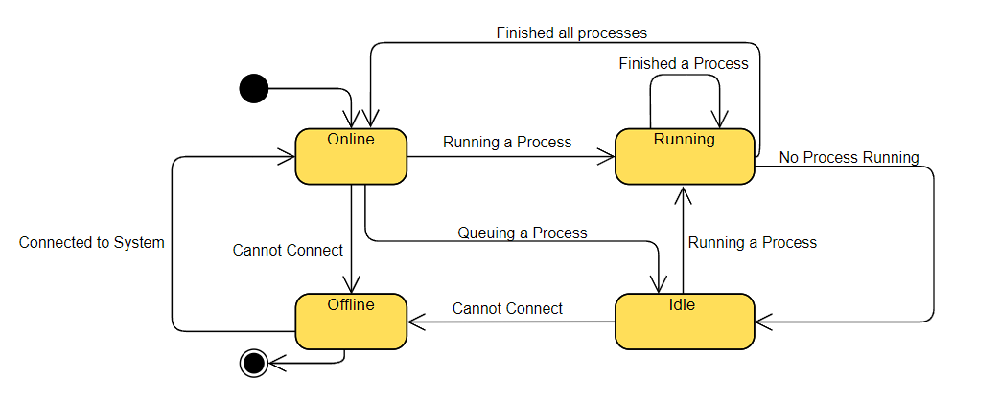

# E-Jam API

## The E-Jam API documentation

This API is used to create and manage streams.
The E-Jam API is a REST API that allows you to manage the list of streams in the E-Jam application.
The API is implemented using the Actix Web framework and Rust.

The API is hosted on a Raspberry Pi 4 Model B with 4GB of RAM.
The Raspberry Pi is connected to a 1Gbps network.
The Raspberry Pi is running Ubuntu 20.04 LTS.

The API is hosted on port 8080.
The API is hosted on the IP address

## Stream State Machine

The stream state machine is as follows:

note: The stream state finished is only applied when all devices have finished sending and receiving packets.

The Device State Machine is as follows:

## API Documentation

The API documentation is available at [http://localhost:8080/](http://localhost:8080/).

## Routes

### GET /streams

Returns a list of all streams in the list of streams.

### GET /streams/{stream_id}

Returns the stream with the given stream_id.

### POST /streams

Adds a new stream to the list

### DELETE /streams/{stream_id}

Deletes the stream with the given stream_id.

### PUT /streams

Updates the stream with the given stream_id.

### POST /streams/{stream_id}/start

Starts the stream with the given stream_id in body.

### POST /streams/{stream_id}/force_start

Forces the stream with the given stream_id to start.

### POST /streams/start_all

Starts all streams in the list of streams.

### POST /streams/{stream_id}/stop

Stops the stream with the given stream_id.

### POST /streams/{stream_id}/force_stop

Forces the stream with the given stream_id to stop.

### POST /streams/stop_all

Stops all streams in the list of streams.

### GET /streams/{stream_id}/status

Returns the status of the stream with the given stream_id.

### GET /streams/status

Returns the status of all streams in the list of streams.

### GET /devices

Returns a list of all devices in the list of devices.

### GET /devices/{device_ip}

Returns the device with the given device ip address.

### POST /devices

Adds a new device to the list

### DELETE /devices/{device_ip}

Deletes the device with the given device_ip.

### PUT /devices/{device_ip}

Updates the device with the given device_ip.

## Stream object

The structure of the Stream object as a table is as follows:

<table>
<tr>
    <th>Field</th>
    <th>Type</th>
    <th>Required</th>
    <th>Default</th>
    <th>Min</th>
    <th>Max</th>
    <th>Validation</th>
</tr>
<tr>
    <td>stream_id</td>
    <td>String</td>
    <td>Yes</td>
    <td></td>
    <td>3</td>
    <td>3</td>
    <td>stream_id must be 3 characters long alphanumeric</td>
</tr>
<tr>
    <td>delay</td>
    <td>u64</td>
    <td>No</td>
    <td>0</td>
    <td>0</td>
    <td>2^63-1</td>
    <td>stream start time must be greater than 0</td>
</tr>
<tr>
    <td>generators</td>
    <td>Vec of Devices</td>
    <td>Yes</td>
    <td></td>
    <td>1</td>
    <td></td>
    <td>number of generators must be greater than 0</td>
</tr>
<tr>
    <td>verifiers</td>
    <td>Vec of Devices</td>
    <td>Yes</td>
    <td></td>
    <td>1</td>
    <td></td>
    <td>number of verifiers must be greater than 0</td>
</tr>
<tr>
    <td>payload_type</td>
    <td>u8</td>
    <td>Yes</td>
    <td></td>
    <td>0</td>
    <td>2</td>
    <td>payload_type must be 0, 1 or 2</td>
</tr>
<tr>
    <td>number_of_packets</td>
    <td>u32</td>
    <td>Yes</td>
    <td></td>
    <td>0</td>
    <td></td>
    <td>number_of_packets must be greater than 0</td>
</tr>
<tr>
    <td>payload_length</td>
    <td>u16</td>
    <td>Yes</td>
    <td></td>
    <td>0</td>
    <td>1500</td>
    <td>payload_length must be between 0 and 1500</td>
</tr>
<tr>
    <td>seed</td>
    <td>u32</td>
    <td>NO</td>
    <td></td>
    <td>0</td>
    <td></td>
    <td>seed must be greater than 0</td>
</tr>
<tr>
    <td>broadcast_frames</td>
    <td>u32</td>
    <td>Yes</td>
    <td></td>
    <td>0</td>
    <td></td>
    <td>broadcast_frames must be greater than 0</td>
</tr>
<tr>
    <td>inter_frame_gap</td>
    <td>u32</td>
    <td>Yes</td>
    <td></td>
    <td>0</td>
    <td></td>
    <td>inter_frame_gap must be greater than 0</td>
</tr>
<tr>
    <td>time_to_live</td>
    <td>u64</td>
    <td>Yes</td>
    <td></td>
    <td>0</td>
    <td>2^63-1</td>
    <td>time_to_live must be greater than 0</td>
</tr>
<tr>
    <td>transport_layer_protocol</td>
    <td>TransportLayerProtocol</td>
    <td>No</td>
    <td>TCP</td>
    <td></td>
    <td></td>
    <td>transport_layer_protocol must be TCP or UDP</td>
</tr>
<tr>
    <td>flow_type</td>
    <td>FlowType</td>
    <td>No</td>
    <td>BtB</td>
    <td></td>
    <td></td>
    <td>flow_type must be BtB or Bursts</td>
</tr>
<tr>
    <td>check_content</td>
    <td>bool</td>
    <td>No</td>
    <td>false</td>
    <td>0</td>
    <td>1</td>
    <td>check_content must be true or false</td>
</tr>
<tr>
    <td>running_devices</td>
    <td>Vec of IPs</td>
    <td>No</td>
    <td>empty</td>
    <td>0</td>
    <td></td>
    <td>must containe devices running courent stream only when running it</td>
</tr>
<tr>
    <td>stream_status</td>
    <td>StreamStatus</td>
    <td>No</td>
    <td>0</td>
    <td>0</td>
    <td></td>
    <td>must containe the status of the Stream at the current point in time</td>
</tr>
</table>

## Device object

The structure of the Device object as a table is as follows:

<table>
<tr>
    <th>Field</th>
    <th>Type</th>
    <th>Required</th>
    <th>Default</th>
    <th>Min</th>
    <th>Max</th>
    <th>Validation</th>
</tr>
<tr>
    <td>name</td>
    <td>String</td>
    <td>Yes</td>
    <td>ip Variable</td>
    <td>1</td>
    <td></td>
    <td>name must be greater than 0</td>
</tr>
<tr>
    <td>ip</td>
    <td>String</td>
    <td>Yes</td>
    <td></td>
    <td>7</td>
    <td>15</td>
    <td>ip must be between 7 and 15 characters long, ip must be a valid ip address</td>
</tr>
<tr>
    <td>mac</td>
    <td>String</td>
    <td>Yes</td>
    <td></td>
    <td>17</td>
    <td>17</td>
    <td>must be a valid mac address</td>
</tr>
</table>

## System API endpoints

The following endpoints are available for the system API:

<table>
<tr>
    <th>Endpoint</th>
    <th>Method</th>
    <th>Body</th>
    <th>Response</th>
    <th>Description</th>
</tr>
<tr>
    <td>/streams/{stream_id}/finished</td>
    <td>POST</td>
    <td></td>
    <td></td>
    <td>Notify the Admin-Client that the Stream has finished only when the stream is finished in the systemAPI side (must be sent from the systemapi to the admin client)</td>
</tr>
<tr>
    <td>/streams/{stream_id}/started</td>
    <td>POST</td>
    <td></td>
    <td></td>
    <td>Notify the Admin-Client that the Stream has started in one of the systemAPI's (must be sent from the systemapi to the admin client)</td>
</tr>
<tr>
    <td>/connect</td>
    <td>GET</td>
    <td>mac address of the device</td>
    <td>Success</td>
    <td>will be called to Connect to the system API</td>
</tr>
<tr>
    <td>/start</td>
    <td>POST</td>
    <td>StreamDetails</td>
    <td>Success</td>
    <td>generate or verify the Provided Stream</td>
</tr>
<tr>
    <td>/stop</td>
    <td>POST</td>
    <td>stream_id</td>
    <td>Success</td>
    <td>Stop a currently running Stream</td>
</tr>
</table>
