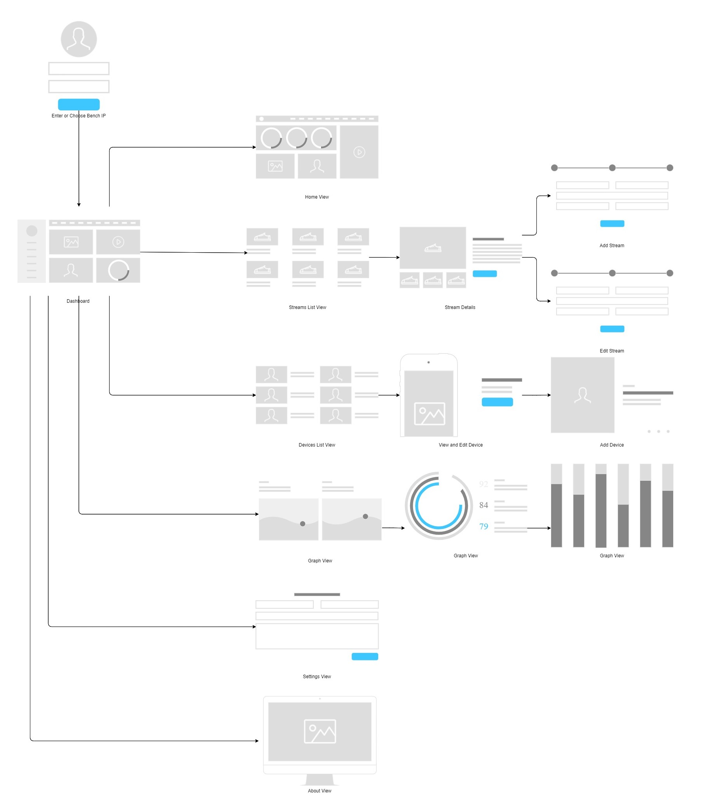

# E-Jam App

## A GUI for Project E-Jam for Testing, Monitoring, and Debugging Switches

### About

This is a GUI for Project E-Jam for Testing, Monitoring, and Debugging Switches. It is written in Dart using the Flutter framework. It is currently in development for Our graduation project and is not ready for use.

### Installation

To install, clone the repository and run `flutter pub get` to install dependencies. Then, run `flutter run` to run the app.

### User Flow Diagram

> Note: This is a work in progress and is not ready for use.
> Note: Any Details View Can be accessed by clicking on the corresponding item in the list view and it will reveal a Graph View filtered by the Item Chosen.
