{width="1.8824015748031495in"
height="1.703125546806649in"}Cairo University

Faculty of Computers and Artificial intelligence

Department of Computer Science

Ethernet Traffic Jam
(E-Jam)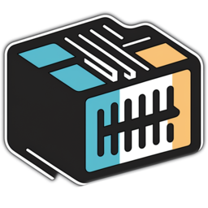{width="1.7395833333333333in"
height="1.7395833333333333in"}

**Supervised by**

Dr. Mohammad El-Ramly

2022-2023

**Implemented by**

  -------------- --------------------------------------------------------
  20190190       Khaled Waleed Fawzy El-Saied

  20190725       Mohamed Amr El hagry

  20190329       Abdallah Mohamed El belkasy

  20190099       Islam Wagih Emam

  20190536       Mostafa Abdullah Mohamed
  -------------- --------------------------------------------------------

# Table of Contents {#table-of-contents .TOC-Heading}

[Chapter 1: Introduction
[5](#chapter-1-introduction)](#chapter-1-introduction)

[1.1 Abstract [5](#abstract)](#abstract)

[1.2 Acknowledgment [5](#acknowledgment)](#acknowledgment)

[1.3 Problem definition [5](#problem-definition)](#problem-definition)

[1.4 Project Objective [5](#project-objective)](#project-objective)

[1.5 Gantt chart of project time plan
[6](#gantt-chart-of-project-time-plan)](#gantt-chart-of-project-time-plan)

[1.6 Technical background
[6](#technical-background)](#technical-background)

[Setting up the DUT [6](#setting-up-the-dut)](#setting-up-the-dut)

[Inter-process communication
[6](#inter-process-communication)](#inter-process-communication)

[Cyclic Redundancy Check
[7](#cyclic-redundancy-check)](#cyclic-redundancy-check)

[RESTful APIs [8](#restful-apis)](#restful-apis)

[Test Setup [8](#_Toc139662069)](#_Toc139662069)

[1.7 Project development methodology
[10](#project-development-methodology)](#project-development-methodology)

[Introduction [10](#introduction)](#introduction)

[Scrum Roles [10](#scrum-roles)](#scrum-roles)

[Scrum Events [11](#scrum-events)](#scrum-events)

[Scrum Artifacts [11](#scrum-artifacts)](#scrum-artifacts)

[Benefits [11](#benefits)](#benefits)

[Challenges [12](#challenges)](#challenges)

[1.8 Tools Used [13](#tools-used)](#tools-used)

[1.9 Report Organization
[15](#report-organization)](#report-organization)

[Chapter 2: Related Work
[16](#chapter-2-related-work)](#chapter-2-related-work)

[2.1 SolarWinds Network Bandwidth Analyser Pack
[16](#solarwinds-network-bandwidth-analyser-pack)](#solarwinds-network-bandwidth-analyser-pack)

[Product features [16](#product-features)](#product-features)

[Pros [16](#pros)](#pros)

[Cons [16](#cons)](#cons)

[2.2 IPerf [17](#iperf)](#iperf)

[Product features [17](#product-features-1)](#product-features-1)

[Pros [17](#pros-1)](#pros-1)

[Cons [17](#cons-1)](#cons-1)

[2.3 Spirent TestCenter [18](#spirent-testcenter)](#spirent-testcenter)

[Product features [18](#product-features-2)](#product-features-2)

[Pros [18](#pros-2)](#pros-2)

[Cons [18](#cons-2)](#cons-2)

[2.4 Paessler PRTG Network Monitor
[19](#paessler-prtg-network-monitor)](#paessler-prtg-network-monitor)

[Product features [19](#product-features-3)](#product-features-3)

[Pros [19](#pros-3)](#pros-3)

[Cons [19](#cons-3)](#cons-3)

[2.5 Wireshark [20](#wireshark)](#wireshark)

[Product features: [20](#product-features-4)](#product-features-4)

[Cons [20](#cons-4)](#cons-4)

[2.6 Nagios [21](#nagios)](#nagios)

[Product features [21](#product-features-5)](#product-features-5)

[Pros [21](#pros-4)](#pros-4)

[Cons [21](#cons-5)](#cons-5)

[Chapter 3: System Analysis [22](#_Toc139662103)](#_Toc139662103)

[3.1 Project specifications
[22](#project-specifications)](#project-specifications)

[3.1.1 Functional Requirements
[22](#functional-requirements)](#functional-requirements)

[3.1.2 Non-functional Requirements
[23](#non-functional-requirements)](#non-functional-requirements)

[3.2 Use-case Diagram [24](#use-case-diagram)](#use-case-diagram)

[Chapter 4: System Design
[25](#chapter-4-system-design)](#chapter-4-system-design)

[4.1 System architecture
[25](#system-architecture)](#system-architecture)

[4.2 Component diagram [26](#component-diagram)](#component-diagram)

[4.3 Class Diagram [27](#class-diagram)](#class-diagram)

[4.4 Sequence Diagrams [31](#sequence-diagrams)](#sequence-diagrams)

[Configuration creation sequence:
[31](#configuration-creation-sequence)](#configuration-creation-sequence)

[Instances creation sequence:
[31](#instances-creation-sequence)](#instances-creation-sequence)

[Generation of a packet sequence:
[32](#generation-of-a-packet-sequence)](#generation-of-a-packet-sequence)

[Verification of a packet sequence:
[32](#verification-of-a-packet-sequence)](#verification-of-a-packet-sequence)

[4.5 GUI Design [33](#gui-design)](#gui-design)

[Introduction [33](#introduction-1)](#introduction-1)

[GUI Design Principles and Best Practices
[33](#gui-design-principles-and-best-practices)](#gui-design-principles-and-best-practices)

[GUI Components [34](#gui-components)](#gui-components)

[Visual Design Guidelines
[48](#visual-design-guidelines)](#visual-design-guidelines)

[Typography [50](#typography)](#typography)

[Visual Style [50](#visual-style)](#visual-style)

[Iconography [50](#iconography)](#iconography)

[Imagery and Graphics
[50](#imagery-and-graphics)](#imagery-and-graphics)

[Visual Feedback [50](#visual-feedback)](#visual-feedback)

[Branding [50](#branding)](#branding)

[Usability Testing and Iteration
[50](#usability-testing-and-iteration)](#usability-testing-and-iteration)

[Conclusion [51](#conclusion)](#conclusion)

[Chapter 5: Implementation and Testing
[51](#chapter-5-implementation-and-testing)](#chapter-5-implementation-and-testing)

[5.1 Mechanism of statistics generation and transmission
[51](#mechanism-of-statistics-generation-and-transmission)](#mechanism-of-statistics-generation-and-transmission)

[Generator and verifier
[51](#generator-and-verifier)](#generator-and-verifier)

[System API [51](#system-api)](#system-api)

[5.2 Generation and verification of Packets
[52](#generation-and-verification-of-packets)](#generation-and-verification-of-packets)

[Acquisition of stream configuration
[52](#acquisition-of-stream-configuration)](#acquisition-of-stream-configuration)

[Generation process [52](#generation-process)](#generation-process)

[Forwarding process [53](#forwarding-process)](#forwarding-process)

[Verification process
[53](#verification-process)](#verification-process)

[5.3 Random Packet Generation and Verification
[54](#random-packet-generation-and-verification)](#random-packet-generation-and-verification)

[5.4 Sub-system communication
[54](#sub-system-communication)](#sub-system-communication)

[Communication between (Generator/Verifier) and (Gateway)
[54](#communication-between-generatorverifier-and-gateway)](#communication-between-generatorverifier-and-gateway)

[Communication between (Generator/Verifier) and (System API for
statistics management)
[54](#communication-between-generatorverifier-and-system-api-for-statistics-management)](#communication-between-generatorverifier-and-system-api-for-statistics-management)

[Communication between (Generator/Verifier) and (System API for
configuration)
[55](#communication-between-generatorverifier-and-system-api-for-configuration)](#communication-between-generatorverifier-and-system-api-for-configuration)

[Communication between (System API) and (Centre point)
[55](#communication-between-system-api-and-centre-point)](#communication-between-system-api-and-centre-point)

[(Centre point) and (Front end)
[56](#centre-point-and-front-end)](#centre-point-and-front-end)

[5.5 Centralized Control System
[58](#centralized-control-system)](#centralized-control-system)

[Multi-Threaded Architecture:
[58](#multi-threaded-architecture)](#multi-threaded-architecture)

[State Verification: [58](#state-verification)](#state-verification)

[State Management: [58](#state-management)](#state-management)

[Communication and Coordination:
[58](#communication-and-coordination)](#communication-and-coordination)

[Error Handling and Fault Tolerance:
[58](#error-handling-and-fault-tolerance)](#error-handling-and-fault-tolerance)

[Scalability and Extensibility:
[59](#scalability-and-extensibility)](#scalability-and-extensibility)

[5.6 Test Design [59](#test-design)](#test-design)

[Scope [59](#scope)](#scope)

[Constraints [59](#constraints)](#constraints)

[5.7 Test Plan [61](#test-plan)](#test-plan)

[Stream Entry [61](#stream-entry)](#stream-entry)

[Device [61](#device)](#device)

[System API Stream Details
[62](#system-api-stream-details)](#system-api-stream-details)

[State Machines [62](#state-machines)](#state-machines)

[Approach [64](#approach)](#approach)

[Test Coverage [65](#test-coverage)](#test-coverage)

[Conclusion [66](#conclusion-1)](#conclusion-1)

[Chapter 6: Future Work
[67](#chapter-6-future-work)](#chapter-6-future-work)

[Historical Data Analysis
[67](#historical-data-analysis)](#historical-data-analysis)

[Command Line Interface
[67](#command-line-interface)](#command-line-interface)

[Passive Monitoring Mode
[67](#passive-monitoring-mode)](#passive-monitoring-mode)

[Improve The Security Level
[67](#improve-the-security-level)](#improve-the-security-level)

[References [68](#references)](#references)

# Chapter 1: Introduction

## 1.1 Abstract

Networking industry is evolving very fast, trying to achieve higher
bandwidth and speeds to fulfil today\'s needs in every aspect of our
life. E-Jam (Ethernet traffic jam) is a software solution that aims to
support the electronic design life cycle of networking devices and
switches by providing tools that enables industry leaders to verify and
qualify network switches through software that provides high performance
network streaming over distributed systems connected to a manufactured
switch with the ability to develop different and custom streaming
scenarios. It also provides monitors and debugging mechanisms that allow
users to perform testing scenarios and automate regressions over a
connected switch. E-Jam will provide subsystems responsible for
processes management, analytics, benchmarking and visualization.

## 1.2 Acknowledgment

We would like to thank Dr. El Ramly and our mentors from Siemens EDA
(Eng. Mohamed Shaaban, Eng. Momen Adel, Eng. Ehab Fawzy, Eng. Belal
Hamdy), for their helpful advice, direction, and monitoring in all the
phases.

## 1.3 Problem definition

With many factors affecting switch performance, it is very useful for
network vendors and network administrators to be able to test the
performance of their switches constantly. It is critical to make sure
the switch is running as intended, as it might be very expensive. Many
products exist to test entire network topologies and measures of switch
performance under certain protocols, but few provide the flexibility to
test multiple protocols under customizable testing conditions.

## 1.4 Project Objective

A viable strategy to deal with problems mentioned earlier is to decipher
the black box enveloping the switching process, so our project aims to
provide the maximum flexibility in switch benchmarking in all its
aspects. We have monitoring, visualization, testing, statistical and
debugging features to make sure the switch is functionally correct. In
collaboration with Siemens EDA company which sees advantages in such a
solution, we aim to implement a high-performance software tool which
uses low-level frame generation to generate highly customizable frames
which allows us to implement a set of well-defined tests mentioned in
RFC2544, RFC2889 to benchmark the switch. Also, SNMP is used to
passively monitor the performance of the switch at any non-testing time.

A simple user interface will be used to visualise the data resulting
from the test to the user and control the system for admin in an
admin-Client User Interface.

## 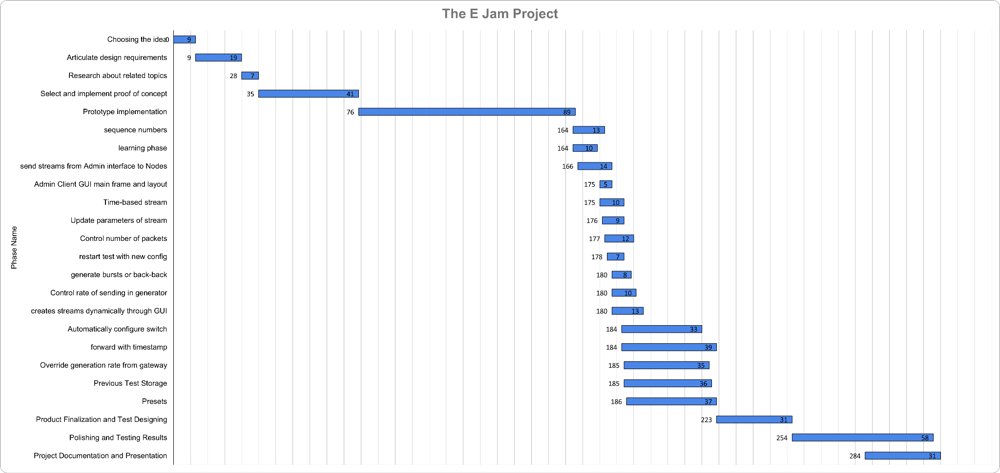{width="7.378472222222222in" height="3.477777777777778in"}1.5 Gantt chart of project time plan

## 1.6 Technical background

### Setting up the DUT

> \- Before starting to perform the tests, the DUT must be configured
> following the [instructions provided]{.underline} to the user (if
> any).
>
> \- Before starting the test, all traffic of [supported
> protocols]{.underline} must be allowed through the switch and no
> further tuning should be done regarding protocols.
>
> \- No vendor-specific filter functions should be used to ensure that
> there is a basis for comparison between vendors.
>
> \- The routing update intervals, keep alive frequency, and [buffer
> sizes]{.underline} should be set once and kept with the same values
> while performing any tests later.

### Inter-process communication

#### 1- Pipes:

*Definition*: Pipes are special files managed by the OS, they act as
FIFO queue with two ends (read and write). Both reading and writing
processes need to open the file at the same time to communicate.
Communication happens this way: the writing end puts the bytes on the
FIFO, it can put more than one item. Meanwhile, the reading process is
blocked, once the reading process detects something was written on the
pipe it unblocks, reads it, then deletes it from the pipe.

There are two types, unnamed pipes and named pipes. Unnamed pipes are
in-memory files created by the processes and deleted at the end of
execution. Named pipes reside in a filesystem and exist outside the
scope of the execution, as its life cycle is independent of the
processes.

*Advantages:* Quick, somewhat easy to use, reliable.

*Limitations:* Both reading and writing processes must be using it
simultaneously all the time, or it will block the other one. This issue
can be worked around using a slave process that just detects the change
thus the slave will be blocked instead of the master process. This issue
still requires using another non-blocking communication method to
deliver data to the master process. Also sends data as raw bytes.

#### 2- POSIX Shared Memory:

*Definition: P*OSIX shared memory is organized using memory-mapped
files, which associate the region of shared memory with a file.

*Advantages:* Skips the part where we must ensure the FIFO file exists,
accessible, non-corrupted, etc...

The read and writing processes are not blocked.

#### 3- Sockets

*Definition:* Sockets are a method of communication using IP and ports
ex. 127.0.0.0:80. It is said to be lower level than pipes.

*Advantages:* In Java they are very easy to use. Sockets are
bidirectional. Allows communication with other machines easily.

*Limitations:* Using Java imposes a challenge related to the use of
multiple programming languages at the same time thus forcing us to use
multiple executables. The other alternative of using sockets with C++,
is unnecessarily a bit more complex than other IPC methods. Also, still
only able to send raw bytes.

### Cyclic Redundancy Check

CRC or Cyclic Redundancy Check is a method of detecting accidental
changes/errors in the communication channel. CRC uses Generator
Polynomial which is available on both sender and receiver side.

An example generator polynomial is of the form like x3 + x + 1. This
generator polynomial represents key 1011.

*Sender side* (Generation of Encoded Data from Data and Generator
Polynomial (or Key)):

1\. The binary data is first augmented by adding k-1 zeros in the end of
the data

2\. Use modulo-2 binary division to divide binary data by the key and
store the remainder of the division.

3\. Append the remainder at the end of the data to form the encoded data
and send the same

*Receiver Side* (Check if there are errors introduced in transmission)

Perform modulo-2 division again and if the remainder is 0, then there
are no errors.

Where:

n: Number of bits of data to be sent from the sender side.

K: Number of bits in the key obtained from the generator polynomial.

### RESTful APIs

A RESTful API is a specific type of API that follows certain guidelines.
REST stands for Representational State Transfer. This means that when a
client requests a resource using a REST API, the server transfers back
the current state of the resource in a standardized representation.

To make the API service RESTful, six guiding constraints must be
satisfied. These are:

\- Use of a uniform interface (UI): To have a uniform interface,
multiple architectural constraints are required to guide the behaviour
of components. Additionally, resources should be unique, so they are
identifiable through a single URL.

\- Client-server architecture: The client and server must be separate
from each other and communicate through HTTP requests and responses.

\- Stateless: The server should not store any client context between
requests. Each request should contain all the information necessary for
the server to understand it.

\- Cacheable: The server should indicate whether a response can be
cached by the client.

\- Layered system: The client should not be able to tell whether it is
communicating directly with the server or with an intermediary.

\- Code on demand (optional): Servers can temporarily extend or
customize the functionality of a client by transferring executable code.

### Test Setup

The user is recommended to consult this section in order to be able to
produce tests which measure certain performance attributes correctly.

It is highly recommended to consult RFC1242, RFC2285, RFC2544, RFC2889
when reading this section.

Our primary test setup will consist of several sender/receiver pairs
with multiple ports.

All frames generated will have a sequence number which will help in
identification of dropped frames, duplicated frames, and out of order
frames. There will be a learning period for the switch in which all the
devices involved in the current test send pings to the switch so that
the switch learns the mac addresses of all packets involved.

The parameters to be automated during the setup are protocol filters and
maximum allowed frame size on the switch. The parameters to be input by
the user are frame size(s), whether to include broadcast frames, and
interframe gap (IFG), and protocol(s) to use.

The frame sizes of all packets will be the same under the normal test.
There is an option for the user to choose a multi-frame size test. In
which case, the user will specify which frame sizes to be included, and
in which ratio. There is an option for the user to include broadcasting
frames in the test to test the ability of the switch to handle flooding
frames. If chosen, the user will specify the percentage of broadcast
frames (this percentage cannot exceed 2%). The broadcast frames will be
evenly distributed across the streams. There is an option for the user
to include certain protocols. In a multiprotocol environment, there will
be an even distribution of frames with the different protocols. The
recommended ratio is even distribution among the frames. The sizes
available are 64, 128, 256, 512, 1024, 1280, 1518.

There will be a facility to control the Interframe gap. There will be a
facility to control the type of traffic which is either bursty or
back-to-back. A flow control facility between the gateway and the
generators will be available. Some test presets will not allow the
modification of traffic types or frame sizes. Presets included are
throughput, latency, frame loss rate, packet integrity.

Preset for measuring throughput:(theoretical frame rate provided)

This preset will use fully meshed traffic.

Each trial will last at least 30 seconds, but the final determination
trail will last at least 60 seconds.

We will binary search for the rate to send packets: Count the total
number of packets sent and total number of packets received. If no
packets are dropped, then we have found a lower bound on the throughput,
and we continue the binary search.

Preset for measuring Latency: (frame size, OPTIONAL throughput)

Before performing this test, it is required to have an exact measurement
of the maximum throughput for the frame size used. There will be a
stream that lasts 60 seconds, followed by a single tagged frame,
followed by another stream which lasts 60 seconds. The switch will be
configured so that when it receives any frame with that tag, it records
the timestamp at which that frame enters, and the timestamp where that
frame exists in the switch and appends them to the frame. The latency
will be the difference in these timestamps, which will be calculated at
the destination device. This test must have at least 20 trials.

#### Frame loss rate: (frame rate)

At each frame size specified above, there will be multiple trials (at
least 10), each trial will send packets at a certain frame rate (the
first trial will send 100% of the maximum rate allowed for the frame
size), then we decrement the frame rate and do another trial. We record
the frame loss percentage calculated at every trial as (number of
received frames - number of transmitted frames)/ number of transmitted
frames \* 100.

#### Packet integrity test:

Devices will be all included in one stream, divided into two equal-sized
groups of generators and verifiers. The stream should be executed, and
every out-of-order packet or wrong payload will be noted and included in
the calculation of error percentage. The test will be repeated five
times with different frame sizes, as previously mentioned.

{width="0.9883945756780402in"
height="0.9439720034995626in"}

There are many topics that are needed to understand how the software
operates fully. However, due to space constraints, we cannot include
them in this document. They can be located here.

## 1.7 Project development methodology

### Introduction

Scrum is an agile project management framework that helps teams'
structure and manage their work through a set of values, principles, and
practices. Scrum is widely used by software development teams because it
encourages them to learn through experiences, self-organize while
working on a problem, and reflect on their wins and losses to
continuously improve. In this section, we will describe how we developed
our project using scrum methodology and what benefits and challenges we
encountered along the way.

### Scrum Roles

Scrum defines three main roles for the team members: the product owner,
the scrum master, and the development team. The product owner is
responsible for defining and prioritizing the product backlog, which is
a list of features and requirements that the team needs to deliver. The
product owner represents the voice of the customer and ensures that the
team delivers value to the stakeholders. The product owner in our case
was the team of Siemens EDA.

The scrum master is responsible for facilitating the scrum process and
coaching the team on how to apply scrum principles and practices.

The development team is responsible for designing, developing, testing,
and delivering the product in increments according to the product
backlog. The development team is self-organizing and cross-functional,
meaning that they have all the skills and expertise needed to complete
the work without relying on external resources.

In our project, we had one product owner, one scrum master, and five
developers. The product owner was also the client who contacted us to
develop this application for verifying, debugging, and monitoring
switching devices.

### Scrum Events

In our project, we followed a two-week sprint cycle. We had sprint
planning meetings every Saturday night for two hours. We had daily scrum
meetings every evening for 15 minutes. Furthermore, we had sprint review
meetings every Friday afternoon for one hour. We had sprint
retrospective meetings right after each sprint review for 30 minutes.

### Scrum Artifacts

Scrum defines three main artifacts for the team to track and manage
their work: product backlog, sprint backlog, and product increment.\
The product backlog is a dynamic list of features and requirements that
represent what the customer wants from the product. The product backlog
is never complete, as new items can be added, modified, or removed at
any time based on customer feedback or market changes.

The sprint backlog is a subset of the product backlog that represents
what the team commits to deliver in one sprint. The sprint backlog is
owned and maintained by us, the development team, who breaks down the
items into smaller and more manageable tasks. It is updated daily during
the sprint, as the team completes the tasks and monitors their
progress.\
In our project, we used Trello Software as a tool to manage our scrum
artifacts. We used the product backlog to store and prioritize our user
stories, which were descriptions of features and functionalities from
the user\'s perspective. We used the sprint backlog to assign and track
our tasks, which were subtasks of user stories with specific details and
acceptance criteria.

### Benefits

Using scrum methodology for our project brought us many benefits and
challenges. Some of the benefits were:

-   [Improved customer satisfaction:]{.underline} By delivering frequent
    and valuable product increments, we were able to meet the
    customer\'s expectations and needs more effectively. We also
    received regular feedback from the product owner, which helped us
    improve our product quality and functionality.

-   [Increased team collaboration:]{.underline} By working as a
    self-organizing and cross-functional team, we were able to leverage
    our diverse skills and expertise to solve problems creatively. We
    also communicated more frequently and transparently with each other,
    which helped us coordinate our work and resolve any issues quickly.

-   [Enhanced team learning:]{.underline} By following scrum principles
    and practices, we were able to learn from our experiences and
    experiments. We also reflected on our performance and improvement
    opportunities during each sprint retrospective, which helped us grow
    as a team and as individuals.

### Challenges

As with every experience, along the benefits, comes the challenges. Some
of the challenges we faced were:

-   [Managing changing requirements:]{.underline} As we developed our
    project, we faced many changes in customer requirements that
    affected our product backlog. We had to adapt our plans and
    priorities accordingly, which sometimes caused delays or rework.

-   Estimating work accurately: As we planned our sprints, we had to
    estimate how much work we could do in one sprint and how long each
    task would take. We often faced difficulties in estimating work
    accurately, especially for complex or unfamiliar tasks. We had to
    adjust our estimates based on our actual progress and the
    circumstances the team members are facing at the sprint planning
    period.

-   [Maintaining quality standards:]{.underline} As we delivered our
    work each sprint, we had to ensure that they met the definition of
    done and satisfied the customer\'s expectations. We sometimes faced
    challenges in testing, debugging, or integrating our software
    components, especially when we had dependencies or technical issues
    such as changes in the execution environment.

## 1.8 Tools Used

E-Jam leverages a powerful and versatile tech stack to deliver its
robust network testing capabilities. Let\'s explore the key technologies
and tools used:

[Wireshark]{.underline}

Wireshark is a free and open-source packet analyser used for network
troubleshooting, analysis, software and communications protocol
development, and education. It listens to a network connection in
real-time and then grabs entire streams of traffic - quite possibly tens
of thousands of packets at a time. We used it to debug many issues and
make sure packets are sent correctly.

[CLion]{.underline}

CLion is an Integrated Development Environment (IDE), used for
developing the C++ part of our system including the Generators and
Verifiers and Gateway of the low-level network packet controller.

[IntelliJ IDEA]{.underline}

IntelliJ IDEA is an integrated development environment (IDE) written in
Java for developing computer software. We used it mainly to develop the
System API component. It was useful especially when dealing with
packaging and maven dependency management.

[Make and Cmake]{.underline}

CMake is an extensible, open-source system that manages the build
process in an operating system and in a compiler-independent manner.
Unlike many cross-platform systems, CMake is designed to be used in
conjunction with the native build environment. It is cross-platform free
and open-source software for build automation, testing, packaging and
installation of software by using a compiler-independent method. We used
it in the development process of many components in our system.

[Visual Paradigm]{.underline}

Visual Paradigm is a tool used for modelling software systems. It has
been used in as a means of creating UML diagrams, ER diagrams, and other
types of diagrams that help to visualise a system\'s architecture. These
diagrams can then be used as a reference to build out the system\'s
components.

[Draw.io]{.underline}

Draw.io is an online diagramming tool that can be used to create
flowcharts, network diagrams, and other types of diagrams. It has been
used to create diagrams that help to explain complex systems or
workflows. These diagrams can be shared with stakeholders, which helps
to ensure that everyone is on the same page.

[Figma]{.underline}

Figma is a design tool that allows teams to collaborate on designs. In
the project, it has been used to create mock-ups of user interfaces,
which can then be shared with developers. This helps to ensure that the
user interface is designed in a way that is intuitive and easy to use.

[GitHub Actions]{.underline}

GitHub Actions is a tool used for automating tasks in a project\'s
development workflow. It has been used to automate tasks such as
building and testing code and notifying team members of changes to the
codebase. This helps to ensure that the development process is
streamlined and efficient.

[Flutter]{.underline}

Flutter is used to develop the cross-platform User Interface (UI)
component of E-Jam. Flutter enables the creation of visually appealing
and responsive interfaces that can run on various operating systems.

[Linux]{.underline}

Linux is an operating system that is used in many big projects. It is
known for its stability, security, and flexibility. It has been used as
a server operating system, as well as a development environment for
developers. Its open-source nature also allows for customization and
optimization for our specific use cases.

[Docker]{.underline}

Docker is a tool used for containerization. It has been used to ensure
that code can be run in a consistent environment, regardless of the
underlying infrastructure. This helps to ensure that code runs the same
way across different environments, which can save time and reduce
errors.

[Qemu]{.underline}

Qemu is a virtualization tool that allows for the creation and
management of virtual machines. In our project, it has been used to
create virtual environments for testing and development. This allows
developers to test code in a controlled environment, on multiple
platforms like macOS, windows, and different Linux distros like Fedora
and Ubuntu, before deploying it to production.

[Kafka]{.underline}

Kafka is a distributed streaming platform that allows for the processing
of large volumes of data in real-time. It has been used for tasks such
as collecting data from various Nodes, processing that data, and then
delivering that data to the Admin Interface. It is known for its
scalability and fault-tolerance.

[Avro]{.underline}

Avro is a data serialization system that is used in big projects to make
it easier to share data between different systems. It allows for the
definition of data schemas, which makes it easier to ensure that data is
consistent across different systems. It is also designed to be
language-agnostic, which means that it can be used with multiple
programming languages.

[Conduktor]{.underline}

Conduktor is a tool used for managing Apache Kafka clusters. It has been
used to manage and monitor The Kafka cluster. It provides a
user-friendly interface for managing topics, partitions, and other
aspects of a Kafka cluster.

[Rust]{.underline}

Rust is a programming language that is known for its performance and
memory safety. It has been used to build the centre point of the system.
Its memory safety features help to reduce the risk of buffer overflows
and other common security vulnerabilities.

[Java]{.underline}

Java is a programming language that is widely used in big projects. It
is known for its portability and scalability. It has been used to build
the system API application. Its large ecosystem of libraries and tools
makes it a popular choice for us.

[Spring Boot]{.underline}

Spring Boot, a Java-based framework, is used to develop the System API
component of E-Jam. Spring Boot provides a robust foundation for
building scalable and reliable applications, enhancing the system\'s
performance.

C++

C++ is a programming language that is known for its performance and
low-level control. It has been used to build the Low network level that
requires high performance. Its low-level control also makes it a popular
choice for our components.

## 1.9 Report Organization

This document is organized into several chapters, each addressing a
specific aspect of the project:

**[Chapter 1:]{.underline}** Introduction - Provides a high-level
overview of the project.

**[Chapter 2:]{.underline}** Competitors and Related Work - Analyses
competitors and explores related tools.

**[Chapter 3:]{.underline}** System Constraints - Discusses functional
and non-functional requirements.

**[Chapter 4:]{.underline}** System Design - Presents system diagrams
and GUI design.

**[Chapter 5:]{.underline}** Testing and System Life Cycle - Outlines
the testing plan and component life cycle.

**[Chapter 6:]{.underline}** Future Work - Identifies potential
enhancements for the system.

# Chapter 2: Related Work

There are many similar products in the market. However, most of them
focus on providing network performance monitoring using SNMP or network
traffic analysis using some flow protocols such as NetFlow or others.
Most products available aim to troubleshoot the entire network, not a
specific network device. Our differentiating factor is that we provide
more extensive benchmarking of the switch itself and are not as
concerned with the overall network performance.

## {width="1.80625in" height="0.8173611111111111in"}2.1 SolarWinds Network Bandwidth Analyser Pack 

SolarWinds Network Bandwidth Analyzer Pack is a tool for monitoring and
analysing the network performance.

### Product features

-   Real-time network traffic monitoring: SolarWinds Network Bandwidth
    Analyser Pack provides real-time monitoring of network traffic,
    allowing you to see where your bandwidth is being used and identify
    any potential bottlenecks.

-   Can detect and resolves network performance issues.

-   Detects which nodes are hogging the bandwidth (using most of the
    bandwidth)

-   SolarWinds Network Bandwidth Analyser Pack also allows you to
    analyse historical network traffic, so you can track trends and
    identify patterns.

-   SolarWinds Network Bandwidth Analyser Pack can forecast your
    bandwidth needs, so you can make sure you have enough bandwidth to
    meet your requirements.

-   SolarWinds Network Bandwidth Analyser Pack generates detailed
    reports that you can use to track your network traffic and identify
    any potential problems.

### Pros

-   Easy to use: SolarWinds Network Bandwidth Analyser Pack is easy to
    use, even for users with no prior experience with network
    monitoring.

-   Scalable: SolarWinds Network Bandwidth Analyser Pack can be scaled
    to meet the needs of small, medium, and large organizations.

### Cons

-   High cost: SolarWinds Network Bandwidth Analyser Pack is a
    commercial product, so it can be expensive.

-   Complexity: Some of the features of SolarWinds Network Bandwidth
    Analyser Pack can be complex to configure and use.

-   Security: SolarWinds Network Bandwidth Analyser Pack has been the
    target of security breaches in the past.

## {width="1.1041666666666667in" height="1.1041666666666667in"}2.2 IPerf

IPerf is a tool for measuring the maximum achievable bandwidth in the
network.

### Product features

-   IPerf can be used to measure the bandwidth between two hosts. This
    can be useful for troubleshooting network performance issues or for
    simply getting an idea of how much bandwidth is available.

-   IPerf can be used to test both TCP and UDP traffic. This is
    important because different applications use different protocols,
    and you may need to test both to get a complete picture of your
    network\'s performance.

-   IPerf has a few configurable settings that allow you to customize
    the test. For example, you can specify the size of the data packets,
    the number of packets to send, and the length of the test.

-   IPerf measures (practical) bandwidth, MTU, and observed read sizes
    for TCP and SCTP specifically.

-   IPerf measures packet loss, delay jitter for UDP

### Pros

-   Free and open-source: IPerf is a free and open-source tool, which
    means that it is available to anyone to use or modify. This makes it
    a cost-effective option for network performance testing.

-   Cross-platform: IPerf is available for a variety of platforms,
    including Windows, Linux, and macOS. This makes it a versatile tool
    that can be used on a wide range of systems.

-   Easy to use: IPerf is relatively easy to use. The command-line
    interface is straightforward, and there are a few tutorials
    available online that can help you get started.

-   Versatile: IPerf can be used to test a wide range of network
    scenarios. This makes it a valuable tool for troubleshooting network
    performance issues or for simply getting an idea of how much
    bandwidth is available.

### Cons

-   Command-line interface: IPerf is a command-line tool, which means
    that you need to be familiar with the command line to use it. This
    can be a barrier to entry for some users.

## {width="1.9041666666666666in" height="0.9916666666666667in"}2.3 Spirent TestCenter

Spirent TestCenter is a comprehensive testing solution for network
performance, scalability, and functionality.

### Product features

-   Spirent TestCenter allows users to generate realistic network
    traffic at various scales, enabling performance testing and
    analysis.

-   It supports a wide range of protocols, allowing users to emulate
    different network scenarios and test devices\' compatibility and
    functionality.

-   The tool can measure and assess QoS parameters such as latency,
    jitter, and packet loss, helping ensure optimal network performance.

-   Spirent TestCenter includes security testing features, allowing
    users to evaluate the resilience of network devices against various
    security threats and attacks.

-   It provides in-depth analysis capabilities to monitor and analyse
    network traffic, enabling users to identify bottlenecks,
    troubleshoot issues, and optimize network performance.

-   Multiple users can collaborate and work simultaneously on test
    scenarios, enhancing productivity in testing environments.

### Pros

-   Comprehensive Testing Capabilities: Spirent TestCenter offers a wide
    range of testing capabilities, allowing users to perform thorough
    testing of network devices and configurations.

-   Realistic Traffic Generation: The tool provides the ability to
    generate realistic network traffic, enabling more accurate testing
    and evaluation of device performance.

-   Protocol Support: Spirent TestCenter supports a broad range of
    network protocols, making it versatile and suitable for testing a
    variety of devices and network configurations.

-   Advanced Analysis and Reporting: The tool offers robust analysis and
    reporting features, providing detailed insights into network
    performance and test results.

-   Scalability: Spirent TestCenter can scale to support large-scale
    network testing scenarios, making it suitable for testing complex
    network infrastructures.

### Cons

-   Complexity: Spirent TestCenter can be complex to set up and use,
    especially for users who are new to network testing tools. It may
    require a learning curve and training to utilize its full potential
    effectively.

-   Cost: Spirent TestCenter is a commercial tool, and the cost may be a
    consideration for some organizations, particularly for smaller
    businesses with limited budgets.

-   Resource Intensive: Running extensive tests with Spirent TestCenter
    may require significant hardware resources, such as powerful servers
    and high-speed network interfaces.

## {width="1.7722222222222221in" height="1.1041666666666667in"}2.4 Paessler PRTG Network Monitor

PRTG Network Monitor is a comprehensive network monitoring tool that
provides real-time monitoring of network devices, bandwidth, and
traffic.

### Product features

-   PRTG can automatically discover all the devices on your network, so
    you don\'t have to manually add them.

-   PRTG comes with a wide range of preconfigured sensors that can be
    used to monitor different aspects of your network, such as bandwidth
    usage, server uptime, and application performance.

-   PRTG allows you to create custom dashboards and maps to visualize
    your network data.

-   PRTG can send alerts and notifications when problems are detected on
    your network.

-   PRTG can generate reports that can be used to track the performance
    of your network over time.

-   PRTG monitors SNMP-enabled network devices.

-   PRTG analyses network traffic.

### Pros

-   Easy to use: PRTG is easy to use, even for beginners.

-   Scalable: PRTG can be scaled to monitor large networks.

-   Cost-effective: PRTG is a cost-effective solution for network
    monitoring.

### Cons

-   Not open source: PRTG is not an open-source solution.

-   Can be complex: PRTG can be complex to configure for complex
    networks.

-   Requires a paid subscription: PRTG requires a paid subscription to
    use.

## {width="2.1125in" height="0.9930555555555556in"}2.5 Wireshark

Wireshark is a popular open-source network protocol analyser that allows
you to capture, analyse, and troubleshoot network traffic.

### Product features:

-   Wireshark captures network packets and provides detailed information
    about each packet, including source and destination addresses,
    protocols, and payload.

-   Wireshark offers robust filtering capabilities to focus on specific
    network traffic based on various criteria such as source/destination
    IP, protocol, port, and more.

-   Wireshark supports a wide range of protocols, including Ethernet,
    IP, TCP, UDP, HTTP, DNS, SSL/TLS, and many others.

-   It allows real-time packet analysis while capturing network traffic,
    helping you identify and diagnose network issues as they occur.

-   Wireshark decodes packets and provides detailed analysis of
    protocols, allowing you to understand network behaviour and identify
    anomalies.

-   Captured packets can be exported in various formats for further
    analysis or sharing with others.

**Pros**

-   Free and Open Source: Wireshark is free to use and open source,
    making it accessible to a wide range of users and allowing community
    contributions.

-   Cross-Platform: Wireshark is available for multiple operating
    systems, including Windows, macOS, and Linux, providing flexibility
    for users.

-   Rich Analysis Capabilities: With its extensive protocol support and
    powerful filtering and analysis features, Wireshark offers deep
    insights into network traffic and helps in troubleshooting.

-   Active Community: Wireshark has a large and active user community,
    providing support, documentation, and ongoing development.

### Cons

-   Resource Intensive: Capturing and analysing network traffic can be
    resource-intensive, especially for high-traffic networks, which may
    require sufficient system resources.

-   Privacy Considerations: As a packet analyser Wireshark can capture
    sensitive information if not used responsibly or with appropriate
    permissions. Users should be cautious about privacy and legal
    considerations.

## {width="2.245138888888889in" height="1.1215277777777777in"}2.6 Nagios

Nagios is a widely used open-source monitoring system that allows you to
monitor the health and performance of various IT infrastructure
components.

### Product features

-   Nagios provides comprehensive monitoring capabilities for network
    devices, servers, applications, services, and other IT
    infrastructure components.

-   It offers customizable alerting and notification mechanisms to
    notify system administrators or designated individuals when issues
    or anomalies are detected.

-   Nagios can generate performance graphs and reports, helping to
    visualize and analyse historical data for better troubleshooting and
    capacity planning.

-   Nagios supports a wide range of plugins and extensions that enhance
    its functionality and enable monitoring of specific technologies or
    platforms.

-   Nagios provides a centralized web-based management interface to
    configure and manage monitoring settings and view real-time status
    and reports.

-   Nagios is designed to scale, allowing you to monitor numerous
    devices and services distributed across different locations.

-   Nagios can integrate with other systems and tools through APIs and
    plugins, facilitating seamless data exchange and automation.

### Pros

-   Flexibility: Nagios offers flexibility in terms of customization and
    configuration, allowing users to tailor monitoring to their specific
    needs.

-   Open Source: Nagios is open-source software, which means it is
    freely available, extensible, and benefits from a vibrant community
    of contributors.

-   Community Support: Nagios has a large and active user community,
    providing support, documentation, and a wide range of plugins and
    extensions.

-   Maturity and Stability: Nagios has been around for a long time,
    making it a mature and stable solution with a proven track record.

-   Extensibility: Nagios can be extended with various plugins and
    add-ons, enabling monitoring of diverse technologies and
    environments.

### Cons

-   Complex Setup: The initial setup and configuration of Nagios can be
    complex, requiring knowledge of system administration, networking,
    and monitoring concepts.

-   User Interface: The Nagios user interface is functional but may not
    be as modern or user-friendly as some commercial monitoring
    solutions.

# Chapter 3: System Analysis

## 3.1 Project specifications

### 3.1.1 Functional Requirements

1.  Central admin GUI-based terminal that acts as an interface for
    > configuring the monitoring and testing procedures. 

```{=html}
<!-- -->
```
2.  Utility to stress test the switch to measure performance and correct
    > sending.

```{=html}
<!-- -->
```
1.  The user will specify nodes for packet generation and others for
    verification.

```{=html}
<!-- -->
```
2.  The groups of the sending and receiving nodes are flexible and allow
    for multiple testing scenarios.

```{=html}
<!-- -->
```
i.  Any configuration can be defined by the user. This can include any
    > subset of nodes for generation and any subset for verification.
    > The same node can be a generator and verifier simultaneously (but
    > is highly discouraged). There is the facility to make any set of
    > nodes generators and any set verifiers (a node can be a generator
    > and verifier simultaneously).

ii. In the beginning of the testing procedure, the user can configure
    > the groups of the sending and receiving nodes using a GUI.

```{=html}
<!-- -->
```
3.  In the beginning of the testing procedure, the user can configure
    the parameters of the generation of the generating nodes.

```{=html}
<!-- -->
```
i.  Target addresses for each stream (can also be broadcast, multicast
    > addresses)

```{=html}
<!-- -->
```
ii. Throughput (total number of bytes to send)

```{=html}
<!-- -->
```
iii. Frame payload size (10-2000)

```{=html}
<!-- -->
```
iv. Type of traffic, bursty or back-to-back

v.  Interval of burst,

vi. Inter-frame gap

vii. Number of packets

viii. Type of packet content

```{=html}
<!-- -->
```
3.  Admin monitors state of system 

```{=html}
<!-- -->
```
1.  Shows active nodes and nodes currently involved in a test. 

```{=html}
<!-- -->
```
2.  Provide information for currently running tests. 

```{=html}
<!-- -->
```
i.  Current rate of transfer of each node 

```{=html}
<!-- -->
```
ii. Error rate (malformed packet rate and packet loss rate) 

iii. Number of dropped packets, out of order packets, packets received
     > correctly, packets received containing errors.

```{=html}
<!-- -->
```
4.  Admin can accept new nodes after starting up. 

```{=html}
<!-- -->
```
5.  Admin controls testing procedure. 

```{=html}
<!-- -->
```
1.  Starts and stops testing procedure. 

```{=html}
<!-- -->
```
2.  Configure test parameters (mentioned in 2) 

```{=html}
<!-- -->
```
3.  Collect performance reports after each test. 

```{=html}
<!-- -->
```
6.  The system supports logging events. 

```{=html}
<!-- -->
```
1.  Each node stores logs internally in a database 

```{=html}
<!-- -->
```
2.  Logs are retrieved on demand.

```{=html}
<!-- -->
```
3.  Only the admin interface can request logs. 

```{=html}
<!-- -->
```
4.  Log events have a certain structure. 

```{=html}
<!-- -->
```
i.  Event-ID: identification number related to that event and the origin
    > machine's mac address (ex 434-xx:xx:xx:xx:xx:xx) 

```{=html}
<!-- -->
```
ii. Type:    Error / Control event (Test Start / Test Termination /
    > Misc)

```{=html}
<!-- -->
```
iii. Time Stamp 

```{=html}
<!-- -->
```
iv. Event report: extra details about the event, this report string will
    > include arbitrary but useful information relevant to the event
    > which could be crash logs, traffic lists status error the type, or
    > (aggregated) statistics for a test.

```{=html}
<!-- -->
```
v.  Delivered: A Boolean value used as an indicator 

```{=html}
<!-- -->
```
5.  Logs marked with Delivered are deleted at regular intervals. 

### 3.1.2 Non-functional Requirements

The devices in the system must include:

1.  The switch to be tested and a different reliable network for the
    communication of different nodes of the system.

2.  A minimum of two testing machines (at least one generator and one
    verifier the verifier machines should be up before the generator
    machines) and a maximum of a number equal to the number of Ethernet
    ports available in the subject.

3.  Each test machine involved in the system must:

    a.  Have at least two network interfaces (to connect separately to
        each of the switches) (i.e., Ethernet and Wi-Fi cards)

    b.  Have minimum requirements of 4 GB of random-access memory and a
        2.8 GHz, 4-Core processor.

    c.  Boot in a Linux/UNIX environment with the following libraries
        and packages installed along with the default binaries present
        in common distros ex. Debian, Fedora.

4.  Linux system with Apache Kafka on it for the Kafka cluster with
    Zookeeper and Schema Registry.

## 3.2 Use-case Diagram

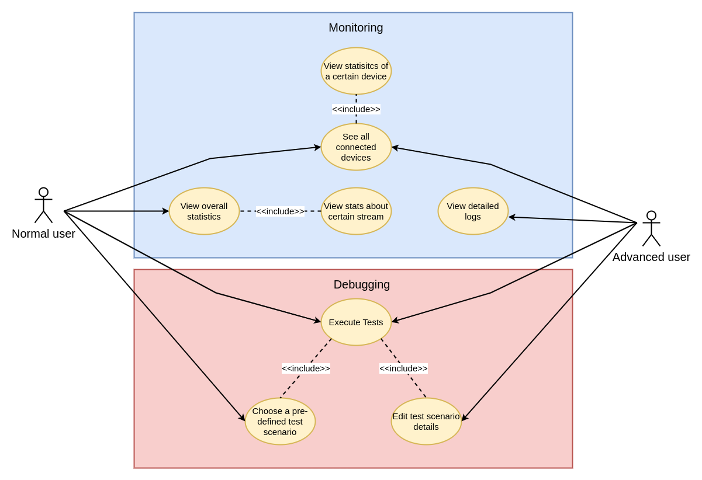{width="6.086614173228346in"
height="4.166666666666667in"}

# Chapter 4: System Design

## 4.1 System architecture

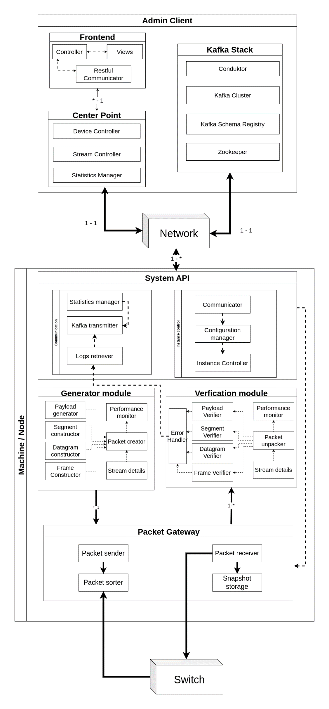{width="2.9375in"
height="6.31748031496063in"}The project consists of eight subsystems
that connect with each other via interfaces, the connections are either
between processes on the same machine (inter-process communication), or
processes on separate machines (network). Four of the main five
subsystems will reside on the same machine which are (System API,
Generator, Verifier, Gateway), while the other components (Centre Point,
Kafka Cluster, Graphical User Interface) will reside on separate
machines, the first group of components (System API, Generator,
Verifier, Gateway) are designed to be replicated and be deployed in any
number of machines across the network to provide the processing power
needed for the test, while the rest are deployed anywhere in the system
which act as a centralized control system, and a monitoring interface
for the users (Admin).

## 4.2 Component diagram

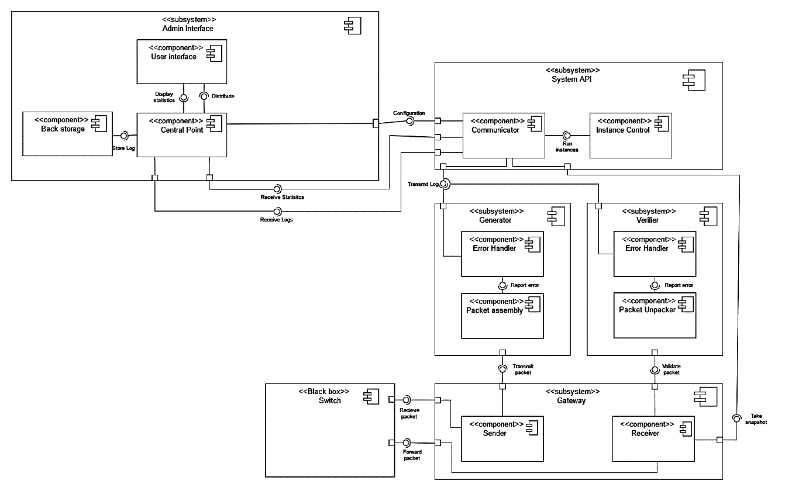{width="6.089583333333334in"
height="3.813102580927384in"}

## 4.3 Class Diagram

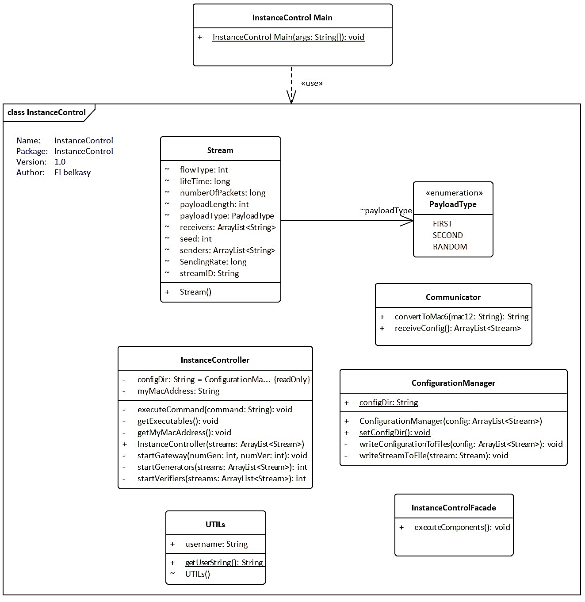{width="6.075694444444444in"
height="6.254861111111111in"}

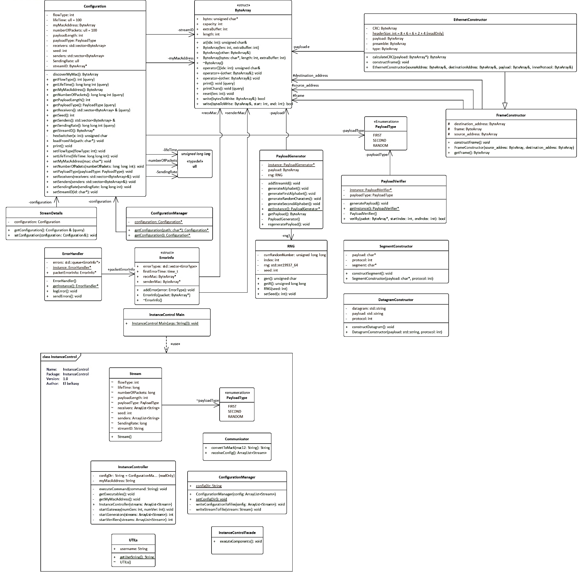{width="10.027777777777779in"
height="6.057638888888889in"}

{width="3.7656255468066493in"
height="10.100464785651793in"}{width="5.567708880139983in"
height="10.104166666666666in"}

## 4.4 Sequence Diagrams

### Configuration creation sequence:

{width="6.682292213473316in"
height="3.8310728346456693in"}

### Instances creation sequence:

{width="6.267716535433071in"
height="3.6511931321084865in"}

### Generation of a packet sequence:

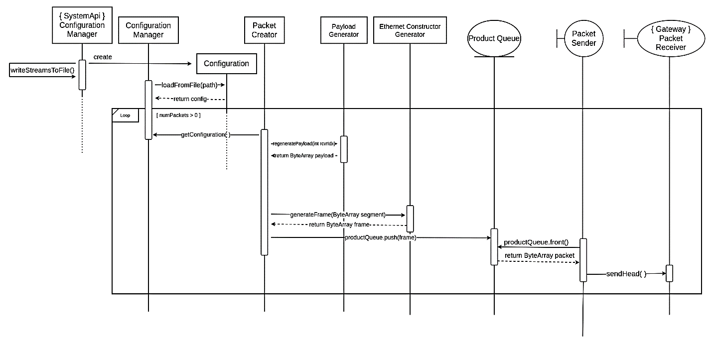{width="6.46875in" height="3.129070428696413in"}

### Verification of a packet sequence:

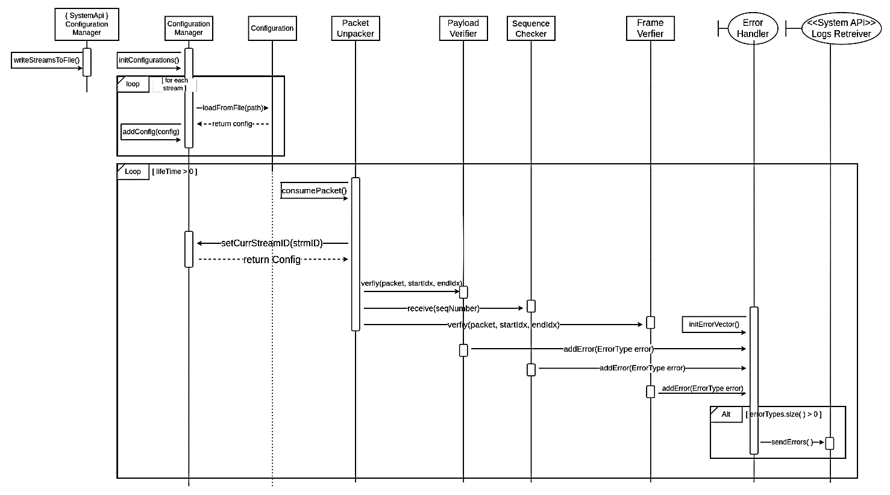{width="6.714119641294838in"
height="3.735404636920385in"}

## 4.5 GUI Design

### Introduction

The purpose of the System GUI Design documentation for the E-Jam project
is to provide a concise and comprehensive guide for designers,
developers, and stakeholders. It communicates design principles, sets
standards, ensures consistency, enhances usability, facilitates
collaboration, and supports maintenance and updates. By following this
documentation, the goal is to create a visually appealing and
user-friendly interface that promotes a positive user experience and
aligns with the project\'s branding and goals.

E-Jam is an enterprise application designed for monitoring, testing, and
debugging Network Switches. The project revolves around a user-friendly
GUI that enables users to interact with the application. Users can add
streams to send and receive data between devices, while also monitoring
these streams through interactive charts provided for each one. The GUI
also allows for the addition of devices and provides real-time status
monitoring of these devices, including the streams running on them.
E-Jam provides comprehensive functionality for efficient network
management and troubleshooting within an enterprise environment.

### GUI Design Principles and Best Practices

GUI Design Principles and Best Practices encompass a set of guidelines
and principles that aim to create effective and user-friendly graphical
user interfaces.

1.  **Consistency**: Maintain a consistent visual style, layout, and
    interaction patterns across the E-Jam GUI to ensure a cohesive and
    familiar user experience.

2.  **Simplicity**: Keep the interface clean and intuitive, minimizing
    complexity and unnecessary clutter. Streamline workflows and
    prioritize essential features to optimize usability.

3.  **User-centred Design**: Prioritize the needs and preferences of
    network administrators and testers when designing the GUI. Conduct
    user research and gather feedback to create an interface that aligns
    with their requirements.

4.  **Feedback and Responsiveness**: Provide real-time feedback and
    visual cues to users\' actions, such as interactive charts and
    status indicators. Ensure a responsive interface that promptly
    reflects changes and updates.

5.  **Accessibility**: Design the GUI to be accessible to users with
    varying abilities. Adhere to accessibility guidelines, including
    proper colour contrast, keyboard navigation support, and assistive
    technology compatibility.

6.  **Visual Hierarchy**: Use visual cues, such as contrasting colours
    and font sizes, to establish a clear hierarchy of elements.
    Highlight important information, such as active streams or device
    statuses, to facilitate quick comprehension.

7.  **Scalability**: Design the GUI to be scalable and responsive,
    adapting to different screen sizes and devices commonly used in
    enterprise environments.

8.  **Error Handling**: Implement clear and user-friendly error messages
    and recovery mechanisms to assist users in troubleshooting and
    resolving issues effectively.

9.  **Documentation**: Provide comprehensive documentation, including
    user guides and tooltips, to assist users in understanding the
    features and functionalities of E-Jam.

10. **Usability Testing and Iteration**: Conduct usability testing with
    network administrators and testers to gather feedback on the GUI
    design. Iterate on the design based on their input to enhance
    usability and address any identified issues.

By following these principles and best practices, the GUI design for the
E-Jam project will aim to deliver an intuitive, efficient, and
user-friendly experience for monitoring, testing, and debugging network
switches.

### GUI Components

#### Menu Bar

The menu bar provides easy navigation and access to important
functionalities within the application.

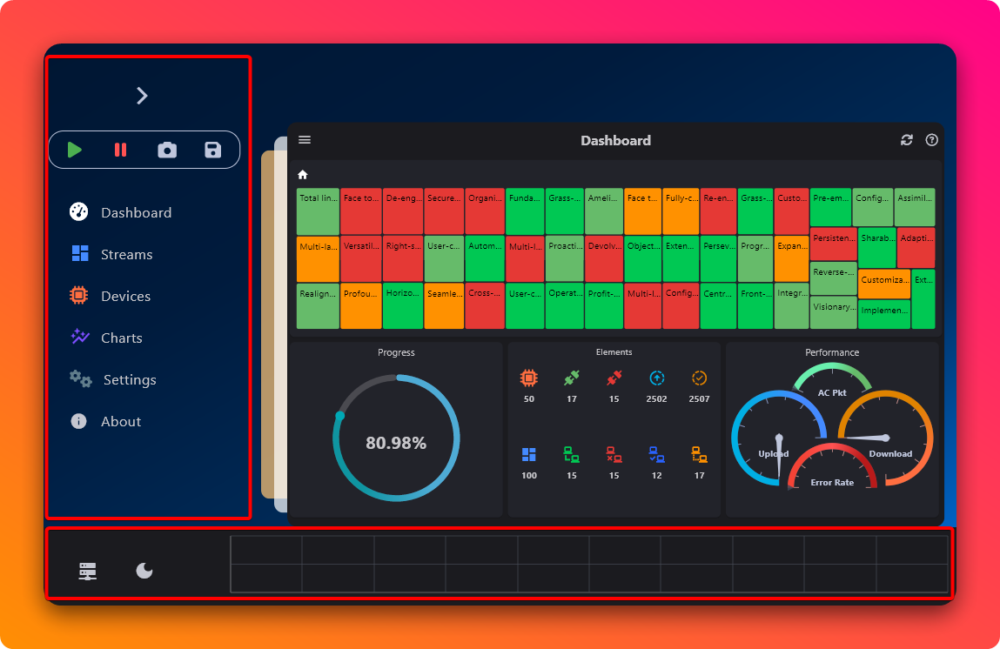{width="5.833333333333333in"
height="3.787351268591426in"}

The menu bar is used as a general controller and navigator to the whole
system, meaning that you can monitor the whole system using only the
menu bar, and you can control all the streams and export data and
statics using the menu bar.

The menu bar goes from top to bottom and starting from the left side to
the right side of the window, with the control buttons at the top left
and the system's total statics chart at the bottom right.

#### Toolbars

The GUI provides Component specific toolbars with icons or buttons for
quick access to frequently used features and actions. Each component has
its own toolbar for controlling it.

First is the main menu toolbar for controlling the whole system by
either running or stopping all the streams and freezing the chart from
consuming statics and exporting any kind of data from the system as a
PDF or CSV.

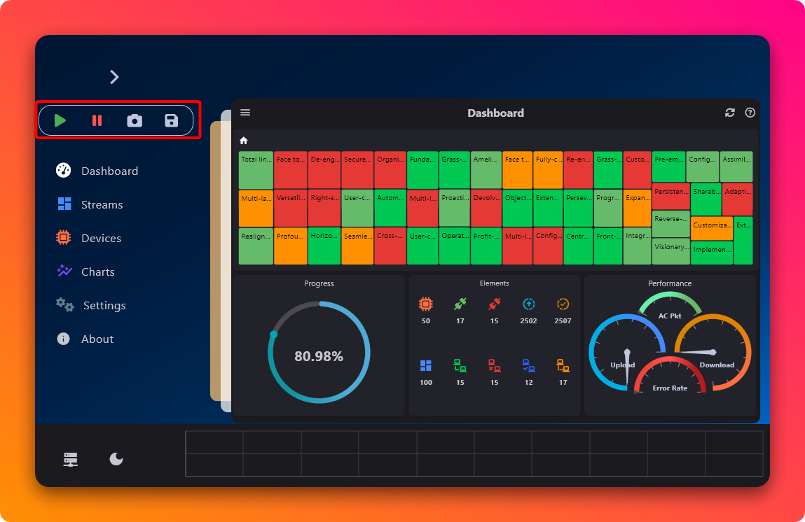{width="5.513576115485565in"
height="3.579746281714786in"}

When exporting Component, you can choose any kind of component to export
and will be outputted in your desired format.

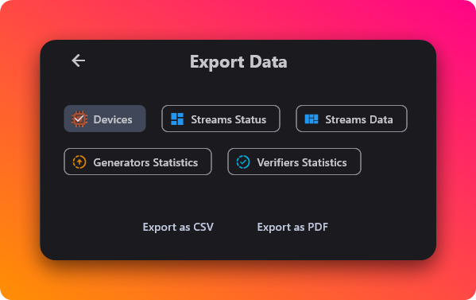{width="5.668226159230096in"
height="3.5674814085739284in"}

The Other Toolbars are the stream Cards Mini toolbar:

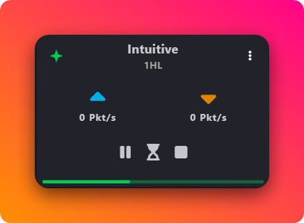{width="4.6in" height="3.378946850393701in"}

and the Stream's higher details toolbar:

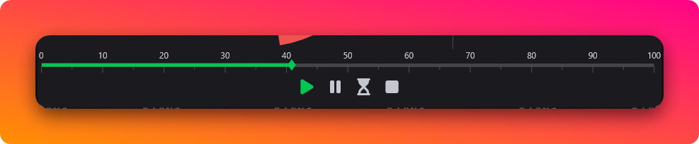{width="5.833333333333333in"
height="1.205673665791776in"}

Both have the same functionalities but in different levels of details.

Other toolbars are the top toolbars.

For the stream:

{width="5.833333333333333in"
height="0.9338057742782152in"}

Used for pinning the stream charts to the charts menu and editing the
details of the stream and deleting it. Which can also be accessed from
the stream card.

For the Device:

{width="5.833333333333333in"
height="0.9619444444444445in"}

The same buttons with an extra button made for pinging the specific
device to check the status of it.

{width="1.6913462379702537in"
height="2.08043416447944in"}

#### Buttons and Icons and Status Indicators

Each button provides details for it as a tooltip and how to use it, and
a specific colour for each status of it.

Examples include but not limited to:

The device card:

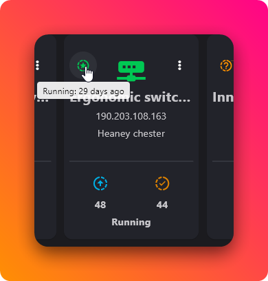{width="4.105262467191601in"
height="4.305262467191601in"}

This means that the device has been running for 29 days with the colour
green indicating that and the icon "star".

The Same for the Stream:

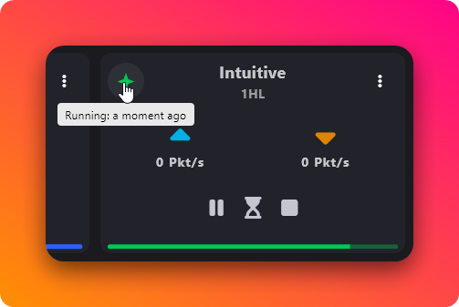{width="5.2947364391951in"
height="3.547367672790901in"}

This means that the stream has started running a moment ago, and it
almost finished.

You can check more details about each icon just by simply hovering or
clicking on it to show more details.

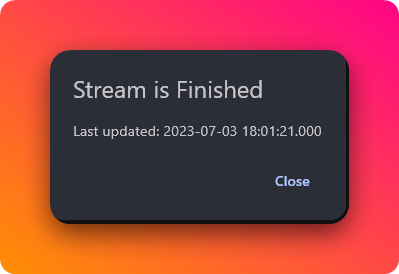{width="3.266949912510936in"
height="2.2434700349956254in"}

There are also drag and drop type buttons for reordering and
enabling/disabling the dashboard extensions, which you can find in the
setting tab.

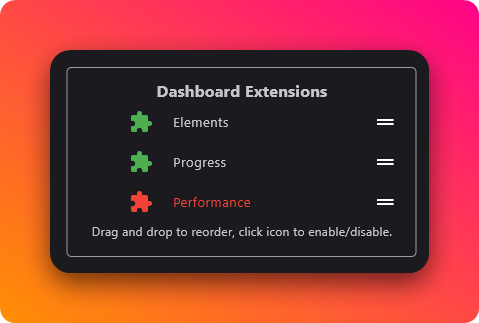{width="3.4041196412948382in"
height="2.2954702537182854in"}

Here is what the Dashboard look like after.\
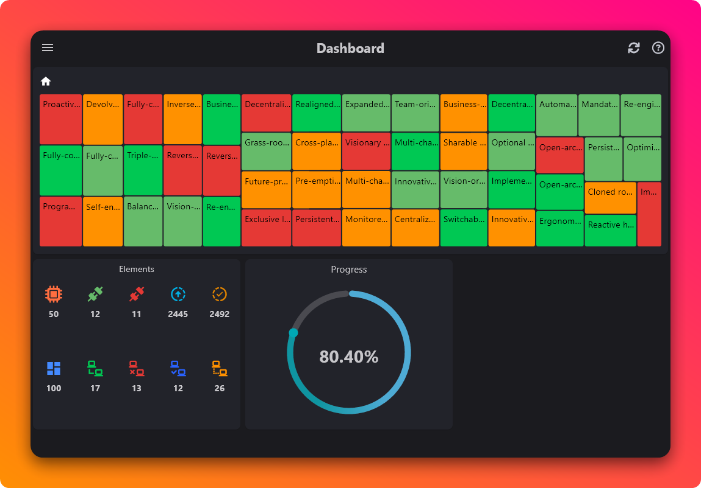{width="5.833333333333333in"
height="4.071655730533683in"}

There are more buttons with specific tasks and signifiers for each one
which you can easily understand by its location or timing and the
tooltip it has or titles for it.

#### Forms and Input Fields

For the input fields, not only was it made to be simple and easy to
understand by having signifiers and details for each section of the
input fields, but it can also be saved for later usage to easily fill
all fields with specified values provided.

The Stream Details are as follows:

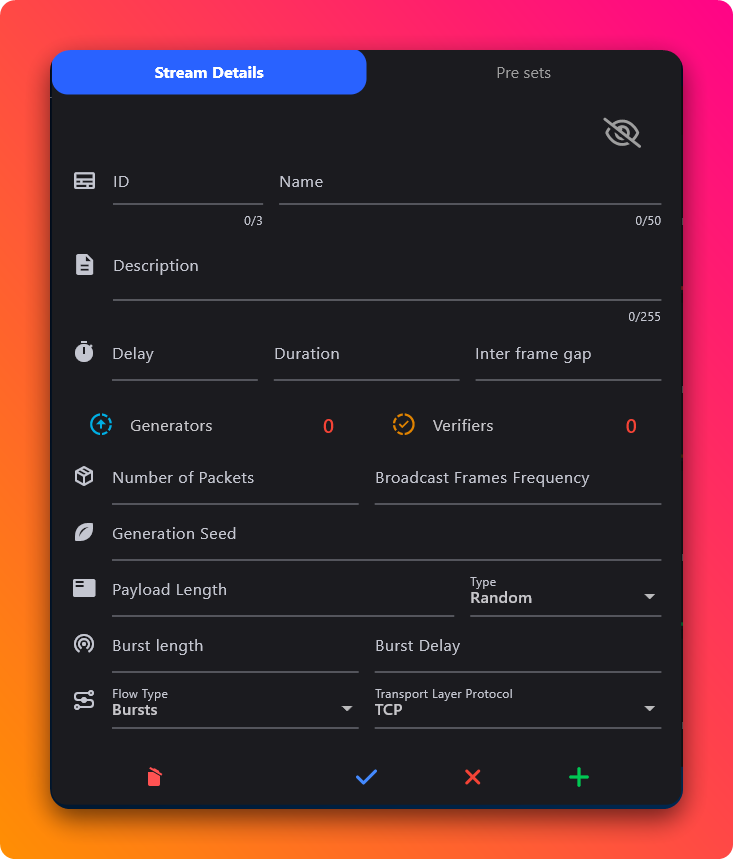{width="5.833333333333333in"
height="6.836060804899388in"}

and it can be easily filled from previously save presets in the preset
tab:

{width="5.833333333333333in"
height="6.852361111111111in"}

For the Device, it's simple, just as follows:

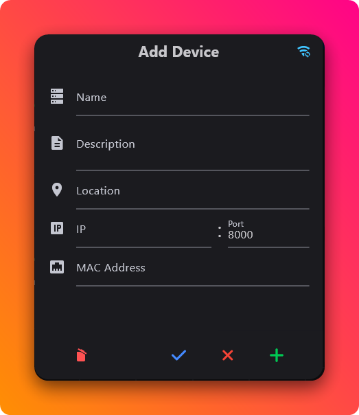{width="4.282436570428697in"
height="4.945680227471566in"}

And you can also easily add a device from the device radar tab at the
top part of the devices tab.

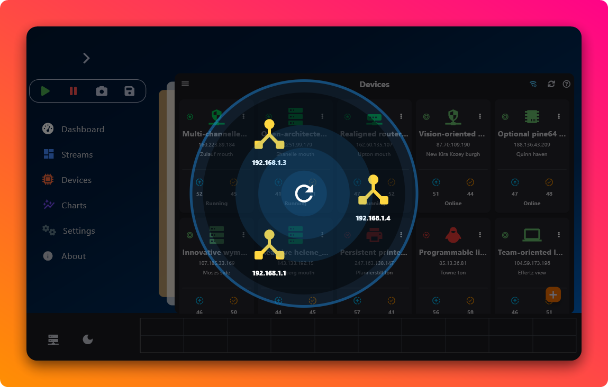{width="5.833333333333333in"
height="3.7162740594925636in"}

#### Lists and Tables

The Three List tabs are the Devices tab, the streams tab, and the chart
tabs for pinned charts all were designed with different means and
utilities to fit the specified component and be more descriptive for it.

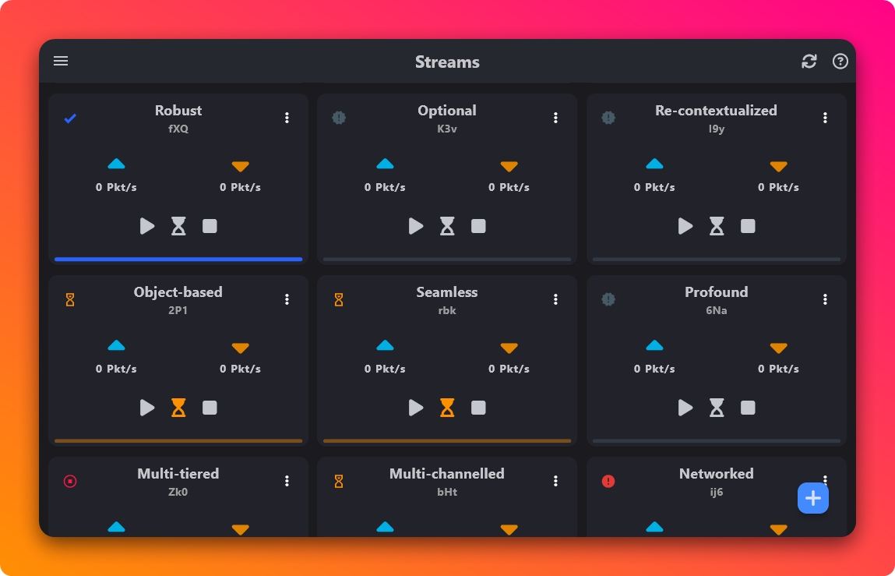{width="5.833333333333333in"
height="3.7518121172353456in"}

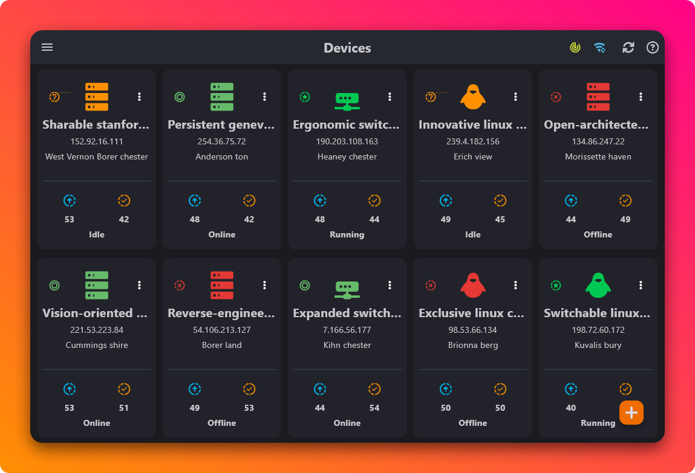{width="5.833333333333333in"
height="3.9751957567804026in"}

#### Charts and Graphs

Include interactive charts and graphs to visually represent network
statistics, performance metrics, or stream data. Charts are shown for
each component on the system, including the total statics on the
systems.

For the streams:

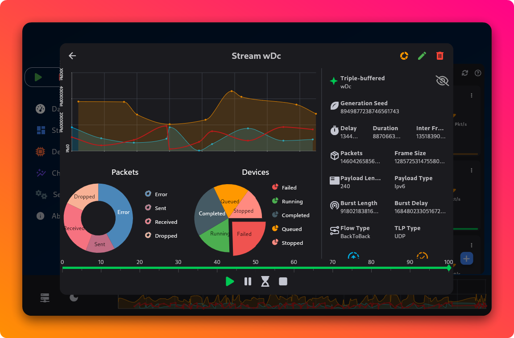{width="5.833333333333333in"
height="3.838251312335958in"}

For the Devices:

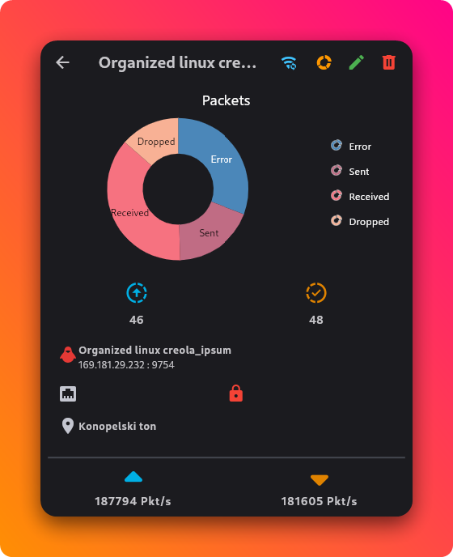{width="3.30332239720035in"
height="4.058366141732283in"}

For the Charts tab:

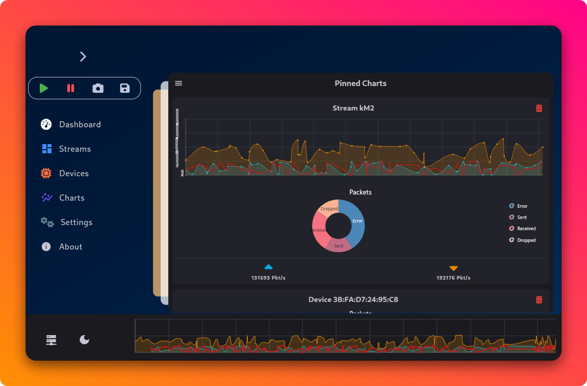{width="5.833333333333333in"
height="3.841586832895888in"}

And as previously mentioned in the menu bar, the total system statics
chart:

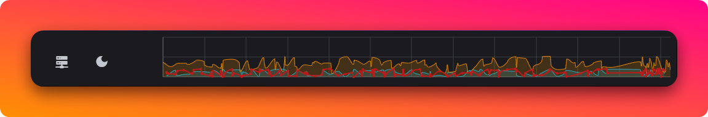{width="5.833333333333333in"
height="0.973066491688539in"}

#### Navigation Components

For the navigation Components, it includes breadcrumb trails, navigation
bars, or hierarchical menus to help users understand their location
within the application and navigate efficiently.

#### Devices tree map

For example, the devices\' tree map in the dashboard tab, which shows at
the first level all the devices in the system with the status of each
one and at the second level it has all data related to the streams the
specified device is running including the status of each process of that
device.

##### Home Level:

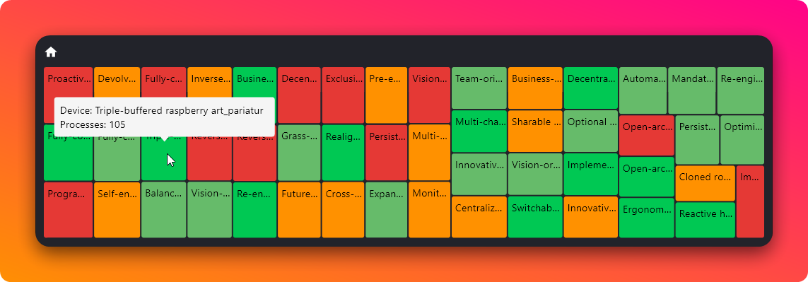{width="5.833333333333333in"
height="2.0363068678915135in"}

##### Second level when clicking on a device:

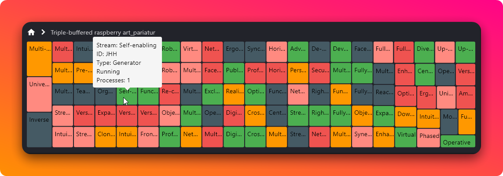{width="5.833333333333333in"
height="2.0516174540682415in"}

Another one is at the stream details of each one to check the status of
each process in that specific stream:

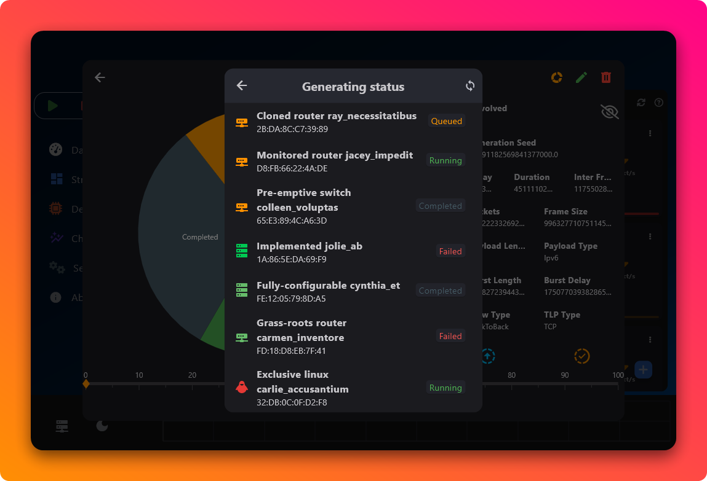{width="5.833333333333333in"
height="3.9751957567804026in"}

These GUI components play a crucial role in creating an effective and
user-friendly interface for the E-Jam project, enabling users to
interact with the application\'s features, manage network switches, and
monitor streams and device statuses effectively.

### Visual Design Guidelines

#### Colour Scheme

A visually pleasing colour palette that aligns with the E-Jam branding
and enhances readability. Using colours strategically to highlight
important elements and create visual harmony.

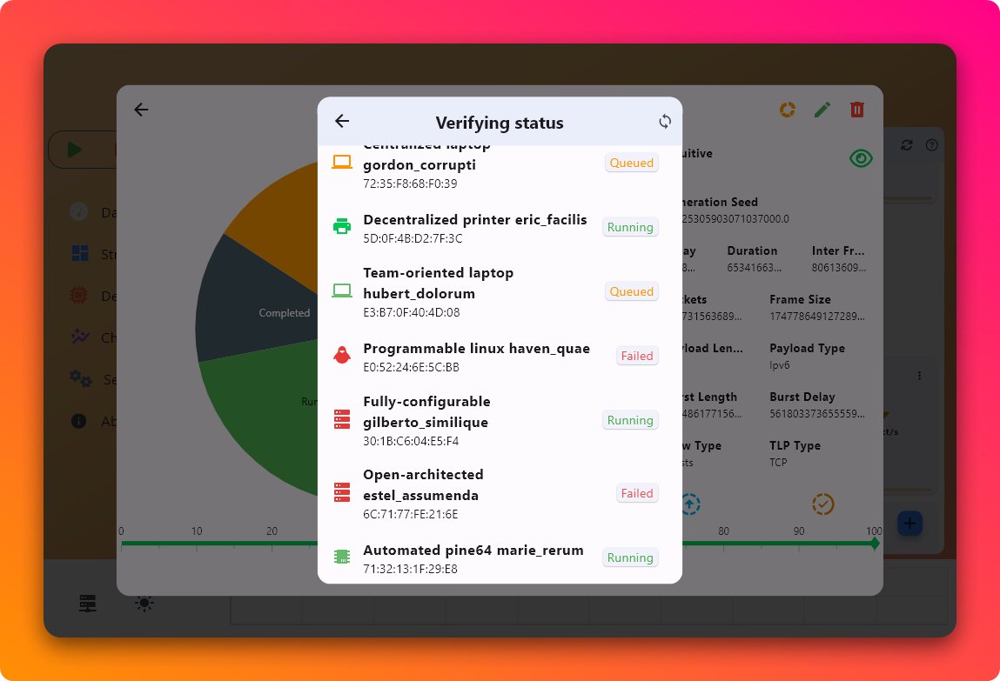{width="5.375694444444444in"
height="3.6631944444444446in"}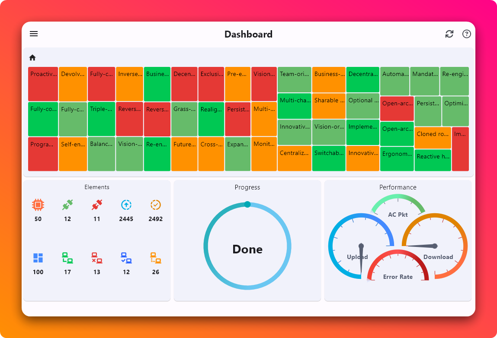{width="5.344444444444444in"
height="3.6416666666666666in"}The system can be in either dark or light
mode according to the user\'s liking. The following are examples of the
light theme of the system.

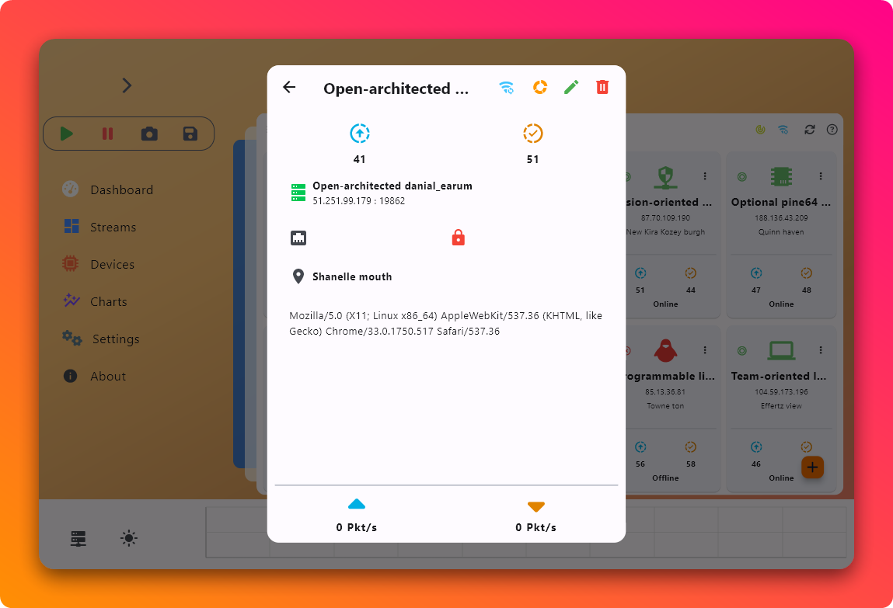{width="5.833333333333333in"
height="3.9751957567804026in"}

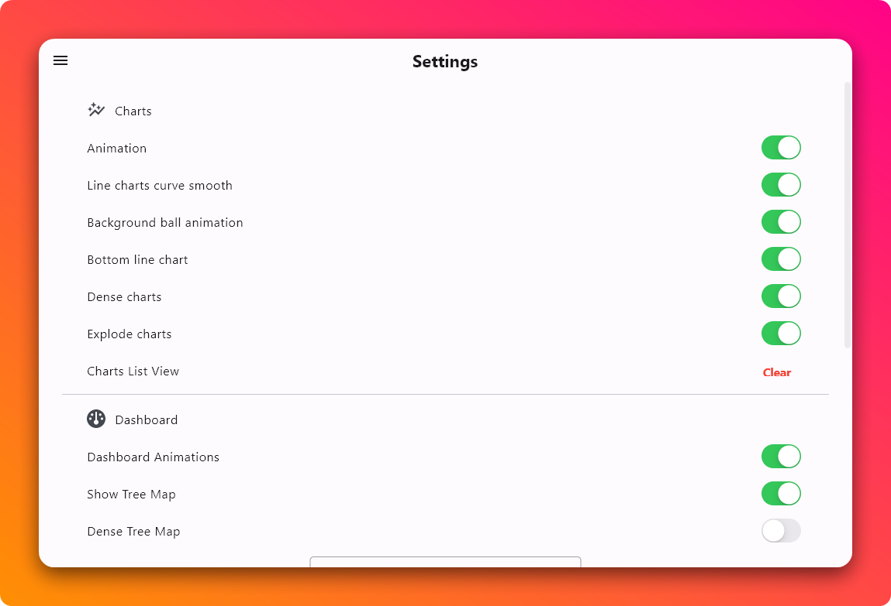{width="5.833333333333333in"
height="3.9751957567804026in"}

### Typography

Selecting the appropriate fonts and font sizes for different UI
elements, ensuring readability and consistency. Paying attention to font
styles, spacing, and line heights to create a visually appealing and
cohesive typographic hierarchy.

### Visual Style

The visual style of the E-Jam GUI design embraces a modern aesthetic,
incorporating contemporary techniques to create a sleek and visually
engaging interface. The design showcases clean lines, minimalist
elements, and a harmonious colour palette that aligns with modern design
trends. By leveraging modern techniques, such as subtle animations,
smooth transitions, and a focus on visual hierarchy, the GUI design of
E-Jam delivers a polished and up-to-date user experience that reflects
the project\'s commitment to contemporary design principles.

### Iconography

Icons has been used effectively to enhance the visual representation of
actions, features, or system status. Ensure that icons are recognizable,
clear, and consistent with the overall visual style.

### Imagery and Graphics

Appropriate imagery and graphics that are relevant to the E-Jam project,
such as network-related visuals or representations of statics and states
of components. Ensuring that graphics are of high quality, optimized for
different screen resolutions, and contribute to the overall aesthetic
appeal.

### Visual Feedback

Using visual cues, such as animations, hero, hover effects, or subtle
changes in colour, to provide feedback to user interactions. This helps
users understand the state of the interface and creates a responsive and
engaging experience.

### Branding

Maintain consistency with the E-Jam brand identity throughout the GUI,
including the use of logos, colours, and typography. Ensure that the GUI
design reflects the overall brand image and values.

By adhering to these Visual Design Guidelines, A visually appealing and
cohesive GUI design for the E-Jam project that aligns with the
project\'s branding, enhances usability, and provides an engaging user
experience has been created.

### Usability Testing and Iteration

To ensure the top quality of the system, the E-Jam project has
implemented a comprehensive approach to usability testing and iteration.
Multiple types of testing have been conducted throughout the design and
development process.

User feedback has been provided by our sponsor and other team members
for multiple components and colour schemes to ensure optimal view and
looks.

### Conclusion

The E-Jam GUI design embodies a modern visual style, incorporating
contemporary techniques to create a sleek and engaging interface. The
use of clean lines, minimalist elements, and a harmonious colour palette
contributes to a visually pleasing and cohesive design. The GUI
components, such as menu bars, buttons, charts, and navigation elements,
have been thoughtfully designed to facilitate seamless interaction and
efficient workflow. The emphasis on accessibility ensures that the GUI
is inclusive and accessible to users with different abilities. Overall,
the E-Jam system GUI design strives to provide a user-friendly and
enjoyable experience, enabling IT professionals to monitor, test, and
debug systems.

# Chapter 5: Implementation and Testing

## 5.1 Mechanism of statistics generation and transmission

### Generator and verifier

The generator and verifier components are the source of the statistics
data and are considered the observable part of the system which acts as
an indicator of the system behaviour and the result of the tests
executed by the admin client.\
There is a specific schema for the data produced by the two components.

The generator is concerned about (Number of packets produced, Number of
packets sent with errors).

The verifier is concerned about (Number of packets received correctly,
Number of erroneous packets, Number of packets not received, Number of
packets received out of order).

Along each generator or verifier instance there exists a singleton
entity called stats Manager which is responsible for keeping track of
the statistics data generated by this specific instance. During the
processing of a packet, the packet is classified to be a member of one
of the types of packets indicated by the schema (such as valid packet,
out of order packet, \... etc), and accordingly the counter of that type
is increased showing that the new packet of that type is processed. The
counters in the stats Manager are reset after each time the statistics
are exported to start a new observing interval, which is one second
(1000 Ms) by default, but it can be changed without interfering with
other components.\
Each generator or verifier instance has a corresponding pipe to write
the collected statistics on, which is read later by the Kafka submodule
inside the system API. The pipes are named pipes (FIFO) that are stored
in a specific directory on the machine running the components.

### System API

The system API has an integral role in this process. It is responsible
for:

-   Locating the statistics data pipes

-   Opening the pipes\
    preventing indefinite blocking of the statistics worker thread in
    generators and verifiers.

-   Consuming data\
    There are two workers in the system API (corresponding to the types
    of managed instances i.e., generators and verifiers). Each worker
    opens the pipes of the assigned type and consumes the data and
    writes what it collected to the main thread of the stats Manager in
    the system API.

-   Transmit the data\
    The aggregated data of all generators and all verifiers running on a
    specific machine is reconfigured and transformed into a data
    structure called Topic (with the help of Avro) which is then used by
    the Kafka broker submodule to transmit statistics to the front-end
    of the application (namely the centre point in the admin client).

## 5.2 Generation and verification of Packets

### Acquisition of stream configuration

Before processing packets, the working module (i.e., generator /
verifier) must be aware of the configuration of the stream which acts as
the template that will be used to process the packets. The configuration
contains information about the fields of the packet, its length, and the
instructions to process it, etc... By knowing the configuration, the
generators of a certain stream will generate packets with contents and
formatting understandable by the verifiers of the same stream. This way,
the verifiers will be able to detect errors caused by external factors
when the received packets are different from what the verifier has
expected.\
The configuration of each working module is received in the system API
of each node from the centre point. The system API provides the
generator/verifier instance with the path to the configuration file on
the node. This ensures that each instance can act independently with a
different configuration to add more flexibility and functionality to the
streams.

### Generation process

Each generator instance is responsible for generating the entire
configuration of a stream, meaning that there can only be one generator
instance per stream per node.

The generation process starts right after the acquisition of the stream
configuration when the system API runs the instance. The generation
behaviour is selected according to the values stated in the
configuration then the packets are produced in that way. The main actor
in this stage is the Packet Creator, which needs the configuration and
the mac address of the testing interface in order to do its function.
Its main driver function createPacket() is used to pace the packet
creation according to the intended sending behaviour.

There are two ways to produce packets which are bursty and back-to-back
(B2B) production. The bursty method is when packets are produced in
bursts separated by a short delay. The B2B method is continuously
sending packets without having to wait for a delay.

The Payload Generator is called to generate a payload with a certain
payload type and length as instructed in the stream configuration. Then,
the sequence number is embedded into the payload to allow tracking out
of order packets.

The payload is then encapsulated inside an Ethernet frame after
generating the headers for that frame (headers such as source address,
destination address, protocol, CRC, \...etc).

Now that the packet is constructed, it is stored in a shared queue
managed by a mutex. That queue is used by another worker thread that
consumes the packets from it and sends them to the next stage of the
pipeline which is the Gateway.

### Forwarding process

The gateway module is responsible for forwarding the packets from the
generator to the switch and from the switch to the correct verifier
instances. It does this by using the unique IDs assigned to the
generator instances and verifier instances by the system API.

The system API assigns IDs to the generator and verifier instances
before launching them. The ID assigned to the generator is the order of
the generator in the list of senders in the stream configuration (after
sorting lexicographically); this is done in order to make verification
easier and faster on the verifier side.

The ID assigned to the verifier is the order of the stream configuration
file in the config folder in /etc/EJam, this is done in order to make
the forwarding of the packets from the gateway to the correct verifier
instance easier and faster.

### Verification process

A single verifier instance is responsible for verifying any packets
received from all generators in the current stream, so a single verifier
instance is launched for each stream the node is involved in as a
verifier.

As with the generation process, this process also starts right after the
acquisition of stream configuration. The Verification process was
designed to mirror the generation process by having the same steps in
reverse order.

A worker thread reads the packets as they are received from the gateway
and then stores them in a queue for further processing by the
verification components. The Packet Unpacker is the verifier\'s
counterpart of the generator\'s Packet Creator Its main function is to
unpack the headers of the frame and verify their integrity and validity
by using the configuration acquired earlier. This verification process
involves parsing the packet and is executed the same way the generator
acts by comparing the expected values of the headers and the payload
with their actual values after passing the network switch (Device under
test).

During the process of generation and verification, statistics are
collected and transmitted using a worker thread in each component.

## 5.3 Random Packet Generation and Verification

This section describes how random packets are generated and verified.
This is a challenge in this system because we must produce multiple
parallel streams of random data (which are random relative to each
other). This is done by using an F2-linear pseudo random number
generator (RNG). We use this type of generator because it is possible to
jump ahead in the RNG state space efficiently with this type of RNG,
effectively "partitioning" the RNG state space and allowing for parallel
random streams.

In our implementation, we use the xoshiro512++ PRNG as it provides a
large state space which allows us to have large partitions and because
there are available online implementations of it which already provide
two jump ahead functions with different lengths which is exactly what we
need. We use the two functions "long jump" and "jump". We use "long
jump" in order to partition the RNG state space amongst the different
generators in a stream. Likewise, we use "jump" in order to partition
that generator partition amongst each packet this generator will create.

## 5.4 Sub-system communication

In the following section, the communication between various parts
(sub-systems) is explained. The communication between subsystems is
present for functional purposes such as commands execution, packet
preparation, and reporting statistics. The reader is expected to be
aware of the system architecture in order to understand the various
components mentioned here and their role in the application.

### Communication between (Generator/Verifier) and (Gateway)

The gateway is implemented in the system to play the role of the unified
interface for receiving and sending packets, as it deals directly with
the device\'s network interface card (NIC). The communication between
the Generators/Verifiers and the Gateway occurs mainly in order to
collect all packets produced from the generators and forward them to the
gateway, and distribute the packets received from other nodes to the
correct verifier process.

The mechanism of communication in this case is the usage of named pipes
(FIFO) that are provided by the Linux kernel. Each generator and each
verifier process communicate with the gateway using its own pipe
dedicated to that communication channel. In our implementation, the
named pipes are in the /\`tmp\` directory making the generators\' pipes
are of this format \`/tmp/fifo_pipe_genX\`, where X is replaced by a
unique ID issued by the System API. The reading and the writing ends of
the pipes does not change during the execution, from the perspective of
the gateway, data is always read from the generator and sent to the
verifier.

### Communication between (Generator/Verifier) and (System API for statistics management)

The statistics that the user needs are produced from these two
processes. The statistics must be sent to the system API first to
aggregate the data from all running processes on the machine and send
them to the admin interface later. The statistical data is written to a
named pipe (FIFO) in the form of a tuple that would be parsed by the
system API and transmitted as a Kafka topic.

In our implementation, the pipe resides on the file system in
\`/etc/EJam/stats/genStats\` and \`/etc/EJam/stats/verStats/\`. The pipe
itself is named, according to its source, (./ID_sgen_0) and
(./ID_sver_0) where the number 0 in this example is replaced with the
instance ID and the \`ID\` is replaced with the three characters
denoting the actual unique stream code (ID).

### Communication between (Generator/Verifier) and (System API for configuration)

After the user has specified the streams that he wants to be executed on
the system, it is transmitted to the System APIs on the nodes in the
network, the exact mechanism of the communication in this stage is to be
mentioned in another section. The next step is to deliver the
configuration to the generators and verifiers to execute it. The
communication of the configuration is not done in a direct manner as
with the other methods mentioned earlier. The system API stores the
configuration as files with a certain format (new line separated values)
in the directory \`/etc/EJam/\`. Each configuration file is named
\`config_abc.txt\`, with the last three characters replaced with the
actual stream ID which is unique across the system and issued by the
admin interface. When the system API runs the generator and verifier
processes, the configuration that this process executes is communicated
as arguments to that process.

### Communication between (System API) and (Centre point)

The communication in this stage is done using a RESTful API. The default
port for the system API is 8000. The following are the endpoints that
the System API provide for the centre point:

**Get / (index)**

will be called to Ping the system API and check if it is Online. (Will
be used in the device\'s Radar)

**Post /connect**

will be called to connect to the system API and register the device in
the system only if the mac address provided is accepted by the system
API.

**Post /start**

Generate or verify the Provided Stream.

**Post /stop**

Stop a currently running stream.

All endpoints' headers will have mac-address = the mac address of the
device that started the stream for verification.

### (Centre point) and (Front end)

The communication in this stage is also done using a RESTful API. The
following are the endpoints that the centre point provides for any
front-end type deployed on any of the operating systems specified
earlier:

**GET /streams**

Returns a list of all streams in the list of streams.

**GET /streams/{stream_id}**

Returns the stream with the given stream_id.

**POST /streams**

Adds a new stream to the list.

**DELETE /streams/{stream_id}**

Deletes the stream with the given stream_id.

**PUT /streams/{stream_id}**

Updates the stream with the given stream_id.

**POST /streams/{stream_id}/start**

Starts the stream with the given stream_id in body.

**POST /streams/{stream_id}/force_start**

Forces the stream with the given stream_id to start.

**POST /streams/start_all**

Starts all streams in the list of streams.

**POST /streams/{stream_id}/stop**

Stops the stream with the given stream_id.

**POST /streams/{stream_id}/force_stop**

Forces the stream with the given stream_id to stop.

**POST /streams/stop_all**

Stops all streams in the list of streams.

**GET /streams/{stream_id}/status**

Returns the status of the stream with the given stream_id.

**GET /streams/status_all**

Returns the status of all streams in the list of streams.

**GET /devices**

Returns a list of all devices in the list of devices.

**GET /devices/{device_mac}**

Returns the device with the given device mac address.

**POST /devices**

Adds a new device to the list.

**DELETE /devices/{device_mac}**

Deletes the device with the given device_mac.

**PUT /devices/{device_mac}**

Updates the device with the given device_mac.

**/devices/{device_mac}/ping**

Pings the device with the given device_mac.

**GET /devices/ping_all**

Pings all devices in the list of devices.

**GET /devices/ping**

Pings the device with the given device data.

**POST /streams/{stream_id}/started**

Notify the system that the stream is started by the device.

**POST /streams/{stream_id}/finished**

Notify the system that the stream is finished by the device.

## 5.5 Centralized Control System

The centralized control system is the core component of the overall
system, responsible for managing the streams between devices, the
devices themselves, and the processes representing the streams running
on each device. This section will provide an overview of the
implementation details of the centralized control system, emphasizing
its role in state verification and management for efficient system
control.

### Multi-Threaded Architecture:

The centralized control system employs a multithreaded architecture to
facilitate concurrent processing and enhance system performance.
Multiple threads are utilized to handle different tasks simultaneously,
allowing for efficient state verification and management across the
streams, devices, and processes. Each thread is dedicated to specific
functionalities, ensuring optimal resource utilization and scalability.

### State Verification:

The primary function of the centralized control system is to verify the
states of the streams, devices, and processes within the system. State
verification is achieved through event-driven notifications, and data
synchronization techniques, enabling real-time monitoring and assessment
of component states.

### State Management:

In addition to state verification, the centralized control system
manages the states of the streams, devices, and processes. It maintains
a comprehensive state database or registry that records the current
state of each component, including operational modes, configurations,
and relevant metadata.

### Communication and Coordination:

To ensure seamless communication and coordination among the components,
the centralized control system acts as a mediator, facilitating data
exchange and interaction. It provides a standardized interface and
communication protocol that enables components to send state updates,
receive commands, and exchange relevant information. The control system
orchestrates the flow of data and commands, ensuring coherent and
synchronized behaviour across the entire system.

### Error Handling and Fault Tolerance:

The centralized control system incorporates error handling mechanisms
and fault tolerance strategies. It detects, diagnoses, and recovers from
errors or failures within the system. In the event of component failures
or inconsistencies, the control system initiates appropriate actions
such as triggering alarms to maintain system integrity and reliability.

### Scalability and Extensibility:

The implementation of the centralized control system supports system
scalability and extensibility. It accommodates the addition of new
streams, devices, and processes without disrupting overall system
operations. The control system architecture allows for easy integration
of new threads, state management modules, ensuring future system growth
and adaptation to changing requirements.

In summary, the centralized control system is responsible for state
verification and management of the streams, devices, and processes
within the system. Its multithreaded architecture, state verification
mechanisms, state management capabilities, communication and
coordination features, error handling and fault tolerance strategies, as
well as scalability and extensibility considerations, collectively
enable efficient and reliable control over the entire system.

## 5.6 Test Design

The purpose of this document is to describe the test design of the E-Jam
project. This includes the testing strategy, the testing environment,
the testing tools, the testing process, and the testing schedule.

### Scope

We had multiple constraints during the testing process. Therefore, we
focused on testing the core functionalities of the project. The Main
scope of this test design is covering the testing strategies such as,
the API test, UI test, and performance test of the system, including
others that were both essential and critical.

### Constraints

Although we faced multiple constraints during the testing process, this
document highlights how we overcame these constraints while working on
the project.

We had limited resources, which meant that we had to prioritize our
testing efforts. Additionally, we encountered time constraints and had
to ensure that we completed testing within the given timeframe.

For the Time constraints, we had a limited amount of time allocated for
testing, so we focused on testing the most critical functionalities
first. To optimize our testing time, we used automation testing for API
testing, which saved us a significant amount of time.

Availability of resources: We faced challenges about the availability of
devices and tools for testing. However, we used tools such as Docker and
virtual machines to simulate different environments and devices, which
allowed us to test a variety of scenarios.

Technical constraints: We faced technical challenges in integrating some
tools and frameworks, but we were able to overcome them by seeking help
from the community and consulting the documentation, and of course our
mentors who helped us a lot. Also reporting bugs on a dependency in the
front-end GUI and downgrading until we found a stable version that could
work, until the dependency was stable.

We also utilized (CI/CD), just for building the front end on cross
platforms, to ensure that it worked properly on different devices and
operating systems, and manually testing some of them that were
available.

For Risks and prioritization, we had multiple decisions that would help
the system significantly, but they were extremely risky.

The first one is that we planned to have the admin client as a single
component to ease the development process, but it turned out to be too
risky, so we decided to split it into multiple components.

Another risk we faced was changing the front-end framework from electron
(A JS framework) to a totally different language and framework, Flutter.

Flutter helped significantly to improve the performance of the UI, but
it was a risky decision as it required us to learn a new language and
framework, and scrape everything that was done before in JavaScript.

However, it was worth the risk as the result was a much better user
experience. As, it offers a wide range of testing tools and widgets
designed for UI.

For UI testing, we used Flutter\'s built-in testing framework, which
allowed us to easily write and execute UI tests on cross-platform
applications, and then switched to manual testing since the test cases
were not strong enough to cover all scenarios.

For API testing, we used postman and Thunder Client to validate the
request and response of the API.

In performance testing, we used to build in tools such as Flutter's
Performance Profiler, and cargo bench for rust, and monitoring the
output statics for the Low Network Level, and as well monitoring the
response time on each request made. Which all seemed to work wonders for
helping improve the system's performance. We also utilized load testing,
which helped us identify areas for improvement in the project.

## 5.7 Test Plan

Throughout the testing process, we maintained regular communication, and
standards that follow throughout the system's flow. Our objective was to
ensure that the project met the specified requirements and was of high
quality, providing a seamless user experience.

The following are example components for standards followed through the
system. We will not explain each parameter and how it works, since you
will find all of them in the centre point's documentation page.

### Stream Entry

{

\"name\": \"Production Stream\",

\"description\": \"This is a stream for production testing.\",

\"lastUpdated\": 1627902000,

\"startTime\": \"2023-07-01T08:00:00Z\",

\"endTime\": \"2023-07-01T16:00:00Z\",

\"delay\": 1000,

\"generatorsIds\": \[\"AA:BB:CC:DD:EE:FF\", \"11:22:33:44:55:66\"\],

\"verifiersIds\": \[\"AA:BB:CC:DD:EE:FF\", \"11:22:33:44:55:66\"\],

\"payloadType\": 1,

\"burstLength\": 5,

\"burstDelay\": 100,

\"numberOfPackets\": 500,

\"payloadLength\": 1024,

\"seed\": 987654321,

\"broadcastFrames\": 100,

\"interFrameGap\": 50,

\"timeToLive\": 128,

\"transportLayerProtocol\": \"UDP\",

\"flowType\": \"BackToBack\",

\"checkContent\": true

}

### Device

{

\"name\": \"Device 1\",

\"description\": \"This device is used for network monitoring.\",

\"location\": \"Office\",

\"lastUpdated\": 1627902000,

\"ipAddress\": \"192.168.1.100\",

\"port\": 8080,

\"macAddress\": \"AA:BB:CC:DD:EE:FF\"

}

### System API Stream Details

{

\"streamId\": \"ABC\",

\"delay\": 500,

\"generators\": \[\"AA:BB:CC:DD:EE:FF\"\],

\"verifiers\": \[\"11:22:33:44:55:66\"\],

\"payloadType\": 2,

\"numberOfPackets\": 1000,

\"payloadLength\": 256,

\"seed\": 12345,

\"broadcastFrames\": 1200,

\"interFrameGap\": 10,

\"timeToLive\": 64,

\"transportLayerProtocol\": 1,

\"flowType\": 0,

\"checkContent\": 1

}

This is used for serializing the Stream Entry JSON that the system API
will execute, after validation.

### State Machines

The following are the State Machines for the main components of the
system.

#### Devices

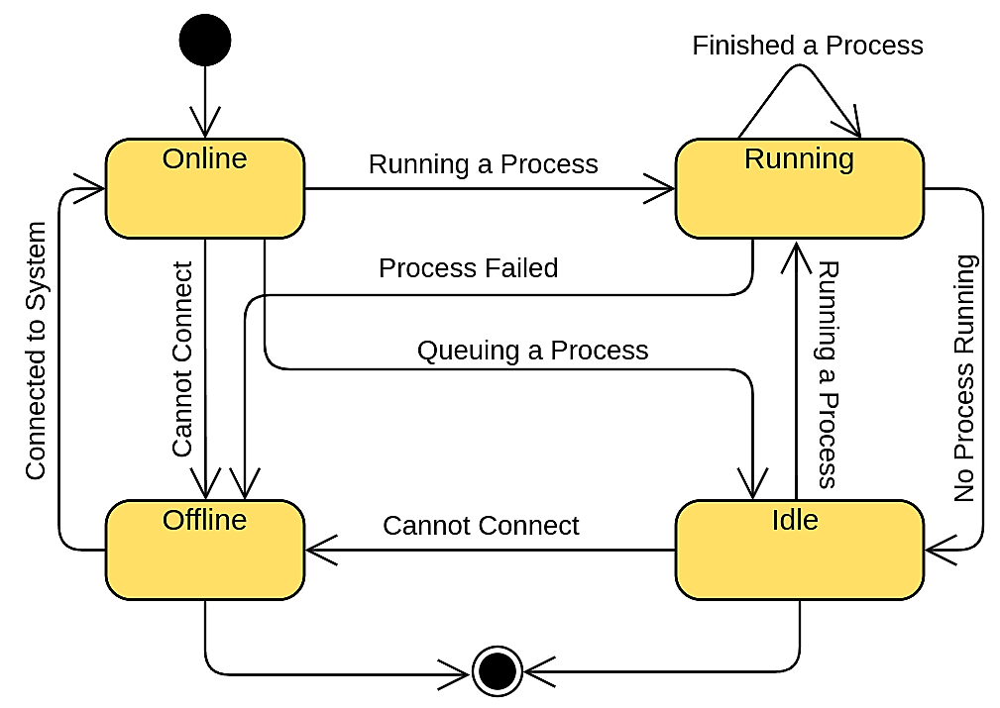{width="4.963686570428696in"
height="3.5094346019247595in"}

#### Processes

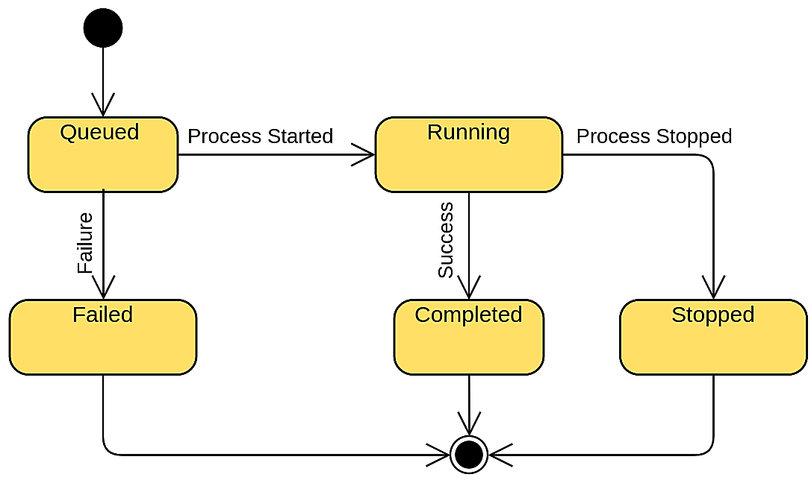{width="5.723273184601925in"
height="3.4069761592300964in"}

#### Streams

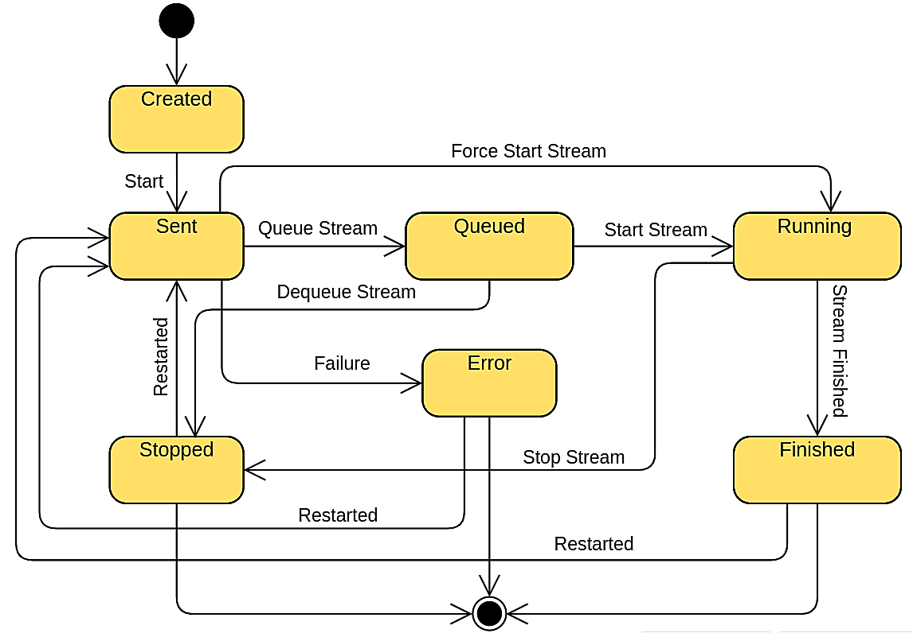{width="6.03125in"
height="4.187689195100613in"}

### Approach

Our goal was to check that each component of the system meets the
specified requirements, and functions correctly. We followed a
systematic approach to testing, including unit testing, integration
testing, system testing, and acceptance testing, performance testing,
and other depending on the specific components.

For unit testing, we tested each component individually, verifying that
it worked correctly in isolation, which was done to all components of
the system.

For integration testing, split the system into two components that both
were heavily tested during the integration testing. The first is the
Admin Client Components that contains the frontend and centre point, and
the other is the Low-Level Components which contain the system API for
communication, and the components responsible for sending and receiving
data.

For system testing, we tested the system, including all components and
interfaces, starting from the network layer all the way to the front
end's charts.

For acceptance testing, we verified that the system met the specified
requirements, both functional and non-functional, and that it was ready
for deployment. We also tested for user scenarios and ensured that the
system was user-friendly and followed the design guidelines of the
project.

For performance testing, we verified that the system was able to handle
large amounts of data, and that it met the required performance
standards.

We also tested for security on the system\'s API.

Finally, we followed a continuous testing approach, where we tested the
system at every stage of development, to ensure that any issues were
caught early and resolved quickly.

We used a combination of manual and automated testing throughout the
process, leveraging automation tools such as postman, Thunder Client,
and Flutter\'s built-in testing framework. And fakers for generating
fake data for testing, and some additional tools for performance
testing. We also performed regression testing after any changes to
ensure that existing functionality was not affected.

In terms of risk prioritization, we focused on testing the most critical
functionalities and used automation testing where possible to save time.

### Test Coverage

To simplify things, we created test cases for each component, and
organized them into categories that were easy to manage. These
categories were based on the type of testing, such as unit, integration,
system, acceptance, performance, or security, etc.

The following is a graph specifying the types of testing done on each
component relative to other components in the same container.

Each component in the hierarchy starts from the top for each component's
unit testing, then all the way down to the System or End-to-End testing.

{width="5.8524901574803145in"
height="7.067708880139983in"}

Notice that the Network Access Layer Component is treated as one
component, since there is always an expected Verifier when generating
data going through the switch.

A lot of components had different types of testing strategies but are
not mentioned in the graphs since they were specific to each component
and were documented separately. However, the main idea was to have full
test coverage and make sure that every component of the system is tested
thoroughly to meet the project\'s requirements.

Each component in the system needed coverage for all the states that it
can be in, including normal, boundary, and error cases. We also made
sure to test any dependencies that the component had, and to cover any
edge cases that could impact the system's stability.

### Conclusion

In conclusion, we have followed a comprehensive and systematic approach
to testing all components and functionalities of the system. By
conducting unit testing, integration testing, system testing, acceptance
testing, performance testing, and security testing, we have ensured that
the system meets the specified requirements and is ready for deployment.

Using a combination of manual and automated testing tools, we have
achieved full test coverage and maintained a level of quality throughout
the development process. Continuous testing and regression testing have
been critical in catching any issues early and resolving them quickly.

Through risk prioritization, we focused on testing the most critical
functionalities and leveraged automation testing to save time and
resources. The thorough testing of each component and their
dependencies, as well as covering normal, boundary, and error cases.

Also, no matter how much we test a system, there is always a chance that
there may be software bugs that are not caught during testing. Deploying
the application and collecting feedback from users is an important step
in identifying and resolving software bugs. Users may encounter issues
that were not anticipated during testing and may provide valuable
feedback that can help improve the application.

#  Chapter 6: Future Work

The following are additional features that were not implemented in this
project for several scheduling-related reasons but will provide great
benefit if implemented in this project in the future.

## Historical Data Analysis

The system by default stores a lot of data from past runs in a dedicated
database. A new subsystem could be developed to make use of the
historical data to predict trends in the system's behavior, identify
hot-spots and assess performance levels across time using an artificial
intelligence model trained on the available data.

## Command Line Interface

The system's admin interface already can run on a variety of operating
systems. But the user might need to use a command line interface to
accelerate doing certain tasks such as stream creation and managing
settings.

Example of such an interface:

  -----------------------------------------------------------------------
  **\>** **EJam** \--add -d       Add new device of with a certain IP
  192.168.1.1                     address
  ------------------------------- ---------------------------------------
  **\>** **EJam** \--add -s       Add new stream and specify devices
  stream1 192.168.1.1 192.168.1.2 

  **\>** **EJam** \--add -s       Add new stream with all devices
  stream2 ALL                     involved

  **\>** **EJam** \--stop stream2 Stop a certain stream

  **\>** **EJam** run             Run the system with the current
                                  configuration

  **\>** **EJam** clear           Resets all streams and forget all
                                  devices
  -----------------------------------------------------------------------

## Passive Monitoring Mode

In addition to the active system monitoring mode that runs during test
execution, a new subsystem could be developed to monitor actual traffic
and identify problems in the flow of packets while users are using the
network for daily usage purposes. The system should be able to notify
the administrator of such problems and allow him to act accordingly.

## Improve The Security Level

The system has not currently gone into the process of security testing
and malicious usage protection iterations. The communication protocols
used in various parts of the system could make use of an encryption
layer. 

The REST API should accept communications from the admin device only
after verifying the authenticity of the source.

The admin interface would provide more security if there was a sign-in
system with only authorized users able to sign in and use the tool.

# References

-   ABRAHAM SILBERSCHATZ. (n.d.). Interprocess Communication. In
    Operating System Concepts, Ninth Edition (pp. 122-136). Essay.

-   Norman, D. A. (2013). The Design of Everyday Things. Basic Books.

-   GeeksforGeeks. (n.d.). Socket Programming in C/C++. Retrieved from
    [[https://www.geeksforgeeks.org/socket-programming-cc/]{.underline}](https://www.geeksforgeeks.org/socket-programming-cc/)

-   MPI Forum. (n.d.). MPI: A Message-Passing Interface Standard.
    Retrieved from
    [[https://www.mpi-forum.org/docs/mpi-2.2/mpi22-report/node208.htm]{.underline}](https://www.mpi-forum.org/docs/mpi-2.2/mpi22-report/node208.htm)

-   Wikipedia. (n.d.). Cyclic Redundancy Check. Retrieved from
    [[https://en.wikipedia.org/wiki/Cyclic_redundancy_check]{.underline}](https://en.wikipedia.org/wiki/Cyclic_redundancy_check)

-   GeeksforGeeks. (n.d.). Modulo-2 Binary Division. Retrieved from
    [[https://www.geeksforgeeks.org/modulo-2-binary-division/]{.underline}](https://www.geeksforgeeks.org/modulo-2-binary-division/)

-   GeeksforGeeks. (n.d.). Modulo-2 Binary Division. Retrieved from
    [[https://www.geeksforgeeks.org/modulo-2-binary-division/]{.underline}](https://www.geeksforgeeks.org/modulo-2-binary-division/)

-   HubSpot Blog. (n.d.). REST APIs: How They Work and What You Need to
    Know. Retrieved from
    [[https://blog.hubspot.com/website/what-is-rest-api]{.underline}](https://blog.hubspot.com/website/what-is-rest-api)

-   GeeksforGeeks. (n.d.). REST API (Introduction). Retrieved from
    [[https://www.geeksforgeeks.org/rest-api-introduction/]{.underline}](https://www.geeksforgeeks.org/rest-api-introduction/)

-   RFC Editor. (1997). Benchmarking Methodology for Network
    Interconnect Devices. RFC 2889. Retrieved from
    [[https://www.rfc-editor.org/rfc/rfc2889.html]{.underline}](https://www.rfc-editor.org/rfc/rfc2889.html)

-   RFC Editor. (1991). Benchmarking Terminology for Network
    Interconnection Devices. RFC 1242. Retrieved from
    [[https://www.rfc-editor.org/rfc/rfc1242]{.underline}](https://www.rfc-editor.org/rfc/rfc1242)

-   RFC Editor. (1998). Definitions of Managed Objects for the SONET/SDH
    Interface Type. RFC 2285. Retrieved from
    [[https://www.rfc-editor.org/rfc/rfc2285]{.underline}](https://www.rfc-editor.org/rfc/rfc2285)

-   RFC Editor. (1999). Benchmarking Methodology for Network
    Interconnect Devices. RFC 2544. Retrieved from
    [[https://www.rfc-editor.org/rfc/rfc2544]{.underline}](https://www.rfc-editor.org/rfc/rfc2544)

-   Rust Programming Language. (n.d.). Retrieved from
    [[https://www.rust-lang.org/]{.underline}](https://www.rust-lang.org/)

-   Flutter. (n.d.). Retrieved from
    [[https://docs.flutter.dev/]{.underline}](https://docs.flutter.dev/)

-   YAML Ain\'t Markup Language (YAML) Version 1.2. (n.d.). Retrieved
    from [[https://yaml.org/]{.underline}](https://yaml.org/)

-   Apache Avro. (n.d.). Retrieved from
    [[https://avro.apache.org/]{.underline}](https://avro.apache.org/)

-   Paessler AG. (n.d.). Retrieved from
    [[https://www.paessler.com/]{.underline}](https://www.paessler.com/)

-   RFC Editor. (1997). Benchmarking Methodology for Network
    Interconnect Devices. RFC 2889. Retrieved from
    [[https://www.rfc-editor.org/rfc/rfc2889.html]{.underline}](https://www.rfc-editor.org/rfc/rfc2889.html)

-   RFC Editor. (1991). Benchmarking Terminology for Network
    Interconnection Devices. RFC 1242. Retrieved from
    [[https://www.rfc-editor.org/rfc/rfc1242]{.underline}](https://www.rfc-editor.org/rfc/rfc1242)

-   RFC Editor. (1998). Definitions of Managed Objects for the SONET/SDH
    Interface Type. RFC 2285. Retrieved from
    [[https://www.rfc-editor.org/rfc/rfc2285]{.underline}](https://www.rfc-editor.org/rfc/rfc2285)

-   RFC Editor. (1999). Benchmarking Methodology for Network
    Interconnect Devices. RFC 2544. Retrieved from
    [[https://www.rfc-editor.org/rfc/rfc2544]{.underline}](https://www.rfc-editor.org/rfc/rfc2544)

-   Atlassian. (n.d.). Agile and Scrum. Retrieved from
    [[https://www.atlassian]{.underline}](https://www.atlassian)

-   Tokio. (n.d.). Tokio Tutorial. Retrieved from
    [[https://tokio.rs/tokio/tutorial]{.underline}](https://tokio.rs/tokio/tutorial)

-   Serde. (n.d.). Serde Derive. Retrieved from
    [[https://serde.rs/derive.html]{.underline}](https://serde.rs/derive.html)

-   Apache Kafka. (n.d.). Introduction to Apache Kafka. Retrieved from
    [[https://kafka.apache.org/intro]{.underline}](https://kafka.apache.org/intro)

-   Confluent Developer. (n.d.). Tutorials. Retrieved from
    [[https://developer.confluent.io/tutorials/]{.underline}](https://developer.confluent.io/tutorials/)

-   Syncfusion Flutter Widgets. (n.d.). Retrieved from
    [[https://flutter.syncfusion.com/]{.underline}](https://flutter.syncfusion.com/)

-   Docker. (n.d.). Get Started, Part 1: Orientation and setup.
    Retrieved from
    [[https://docs.docker.com/get-started/overview/]{.underline}](https://docs.docker.com/get-started/overview/)

-   Wikipedia. (n.d.). Regular Expression. Retrieved from
    [[https://en.wikipedia.org/wiki/Regular_expression]{.underline}](https://en.wikipedia.org/wiki/Regular_expression)

-   Actix. (n.d.). What is Actix?. Retrieved from
    [[https://actix.rs/docs/whatis]{.underline}](https://actix.rs/docs/whatis)

-   Flutter. (n.d.). Profiling Flutter Apps. Retrieved from
    [[https://docs.flutter.dev/cookbook/testing/integration/profiling]{.underline}](https://docs.flutter.dev/cookbook/testing/integration/profiling)

-   Wikipedia. (n.d.). Exploratory Testing. Retrieved from
    [[https://en.wikipedia.org/wiki/Exploratory_testing]{.underline}](https://en.wikipedia.org/wiki/Exploratory_testing)

-   Wikipedia. (n.d.). Regression Testing. Retrieved from
    [[https://en.wikipedia.org/wiki/Regression_testing]{.underline}](https://en.wikipedia.org/wiki/Regression_testing)

-   Joshi, P., Harrold, M. J., & Rothermel, G. (2012). An Extensive
    Comparison of Four Regression Test Selection Techniques.
    [[https://www.sciencedirect.com/science/article/abs/pii/S0164121212002403]{.underline}](https://www.sciencedirect.com/science/article/abs/pii/S0164121212002403)
