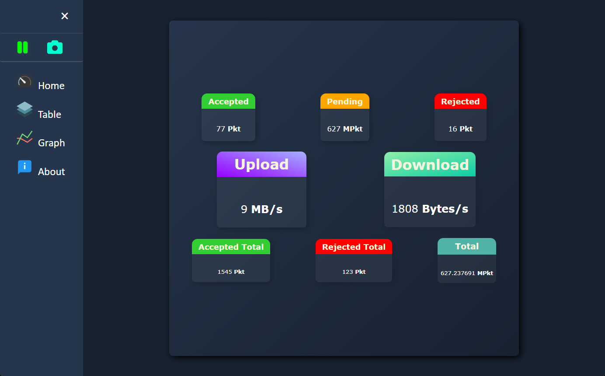
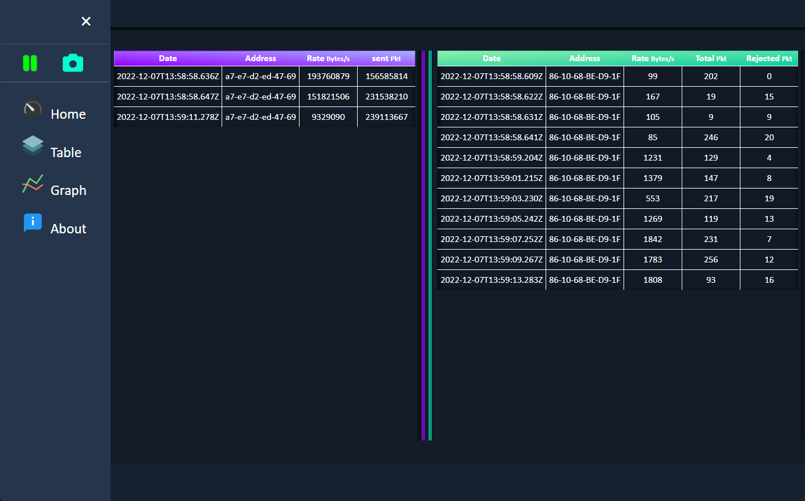
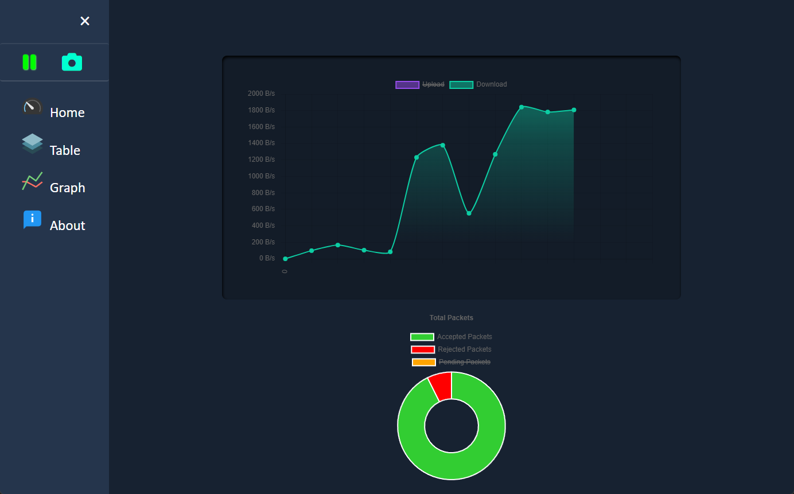

# Admin-Client Electron GUI

Using [ElectronJs](https://www.electronjs.org/) and other dependencies to make Prototype of E-Jam Application.

## Prerequisites

- [node](https://nodejs.org/)

## Running locally

- `npm install` - installs npm dependencies.
- `npm start` - runs Electron App,
- `watch`: runs Electron App and Restarts on Edit

## Client

Client Receives data and deserializes it using the [@kafkajs/confluent-schema-registry](https://www.npmjs.com/package/@kafkajs/confluent-schema-registry) package for nodejs.

## ScreenShots

### Home Window

### Tables Window

### charts Window

#### All JavaScript Files Are in CommonJS standards.

## Further readings

- [electron](https://www.electronjs.org/)
- [@electron/rebuild](https://www.electronjs.org/docs/latest/tutorial/using-native-node-modules)
- [moment](https://momentjs.com/docs/)
- [avsc](https://github.com/mtth/avsc)
- [uuid](https://en.wikipedia.org/wiki/Universally_unique_identifier)
- [CommonJS Vs ES6](https://stackoverflow.com/questions/46677752/the-difference-between-requirex-and-import-x)
