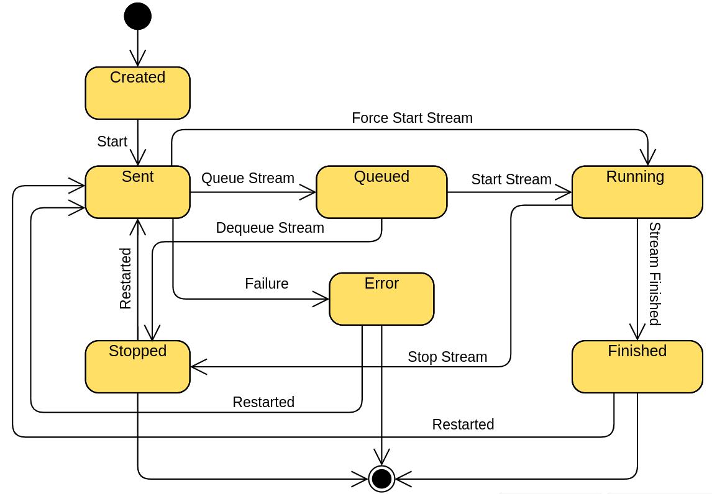

# E-Jam: Distributed System for Network Switch Testing & Monitoring 🚀

<p align="center" > </p>

[](https://opensource.org/licenses/MIT)


A high-performance platform for stress-testing, monitoring, and debugging network switches with customizable scenarios.

---

## 📖 Table of Contents
- [Features](#-features)
- [Tech Stack](#-tech-stack)
- [Installation](#-installation)
- [Walkthrough](#-walkthrough)
- [Architecture](#-architecture)
- [Documentation](#-documentation)
- [Contributing](#-contributing)
- [License](#-license)
- [Acknowledgments](#-acknowledgments)

---

## 🚀 Features

### Core Capabilities
- **Stress Testing**: Measure throughput, latency, and packet loss under custom loads.
- **Real-Time Monitoring**: Live dashboards with interactive charts for packet statistics.
- **Multi-Protocol Support**: Test TCP, UDP, and custom protocols.
- **Distributed Architecture**: Scale tests across multiple nodes via Docker and Kafka.
- **Automated RFC Compliance**: Pre-configured tests for RFC2544, RFC2889, and RFC2899.

### Unique Advantages Over Competitors
| Feature               | E-Jam          |
|-----------------------|----------------|
| Custom Test Scenarios | ✅             | 
| Cross-Platform UI     | ✅ (Flutter)   |
| Real-Time Analytics   | ✅             |
| Open Source           | ✅             | 

---

## 🛠 Tech Stack

**Backend**  


**Frontend**  


**Infrastructure**  


---

## 📦 Installation

### Prerequisites
- Linux-based OS (Ubuntu 22.04 recommended)
- Docker Engine & Docker Compose
- Java 11, Rust 1.68+, Flutter 3.7+

### Steps
> For More Details, each folder has its own README file for other functionalities. This is just  straight-forward,  instructions to run the app.

1. **Clone the Repository**:
   ```bash
   git clone https://github.com/yourusername/E-Jam.git
   cd E-Jam
   ```

2. **Start Kafka Cluster**:
   ```bash
   cd Admin\ Client/kafka_stack_docker_compose
   docker-compose up -d
   ```

3. **Build Admin Client**:
   ```bash
   cd Admin\ Client/e_jam_frontend
   flutter pub get
   flutter build linux  # or windows/macos
   ```
   
4. **Deploy Center Point**:
   ```bash
   cd Admin\ Client/e_jam_backend
   sudo docker build -t center-point .
   sudo docker run --network=host center-point
   ```
   
5. **Deploy System API**:
   ```bash
   cd Prototype/SystemApi
   mvn clean install
   java -jar target/systemapi-1.0.0.jar
   ```
---

## 🎥 Walkthrough

[](https://youtu.be/oPZLR4RM150)

---

## 🏗 Architecture

### Stream State Machine


### Key Components
- **Admin Client**: Cross-platform with UI for test configuration and monitoring.
- **Generators/Verifiers**: C++ modules for packet generation/validation.
- **Kafka Cluster**: Real-time data streaming for distributed analytics.
- **System API**: Java/Spring Boot backend for orchestration.

### Directory Structure
```bash
📁 .
├── 📁 Admin Client          # Flutter UI + Rust backend
├── 📁 Documentation         # PDF specs and presentation
├── 📁 Prototype             # Core components (Old Version)
└── 📁 Screen Shots          # UI previews
```

---

## 📚 Documentation
- [Full Project Description](Documentation/The%20E-Jam%20Project%20Documentation.pdf)
- [Nodes Documentation](Documentation/NodesDocumentation.md)
- [Front end Reference](Admin%20Client/e_jam_frontend/README.md)
- [Center Point Reference](Admin%20Client/e_jam_backend/README.md)
- [Kafka Reference](Admin%20Client/kafka_stack_docker_compose/README.md)
- [Admint Client Reference](Admin%20Client/README.md)

---

## 🤝 Contributing
1. Fork the repository.
2. Create a feature branch: `git checkout -b feat/amazing-feature`
3. Submit a PR with detailed documentation.  
   See [CONTRIBUTING.md](CONTRIBUTING.md) for guidelines.

---

## 📜 License
Distributed under the MIT License. See [LICENSE](LICENSE) for details.

---

## 🙏 Acknowledgments
- **Developers**: Khaled Waleed, Mohamed Amr, Abdallah Mohamed, Islam Wagin, Mostafa Abdullah


### Screenshots
| Dashboard View                          | Stream Configuration                   |
|-----------------------------------------|----------------------------------------|
|  |  |

| Device Monitoring                       | Export Analytics                       |
|-----------------------------------------|----------------------------------------|
|  |  |
